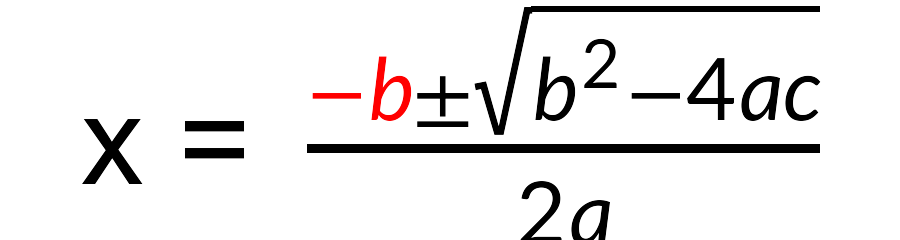
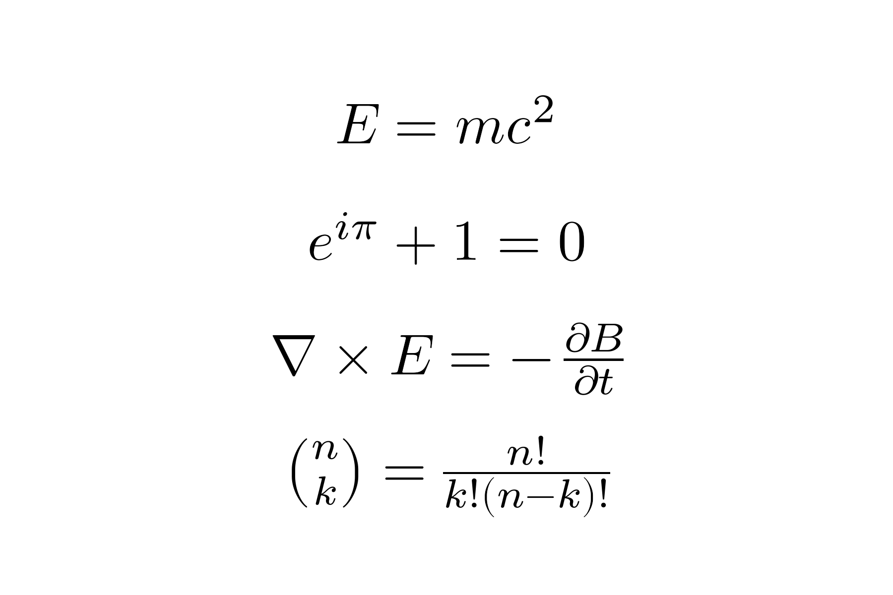
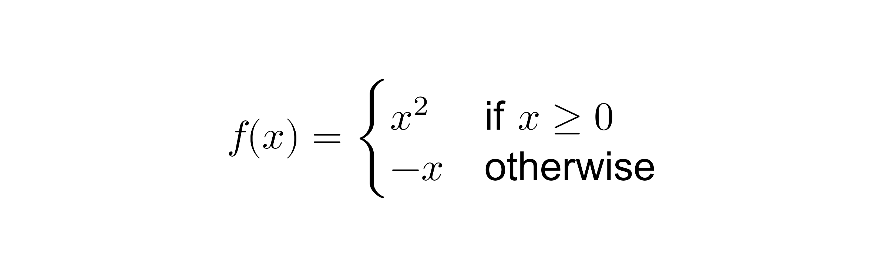
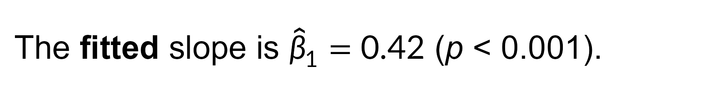
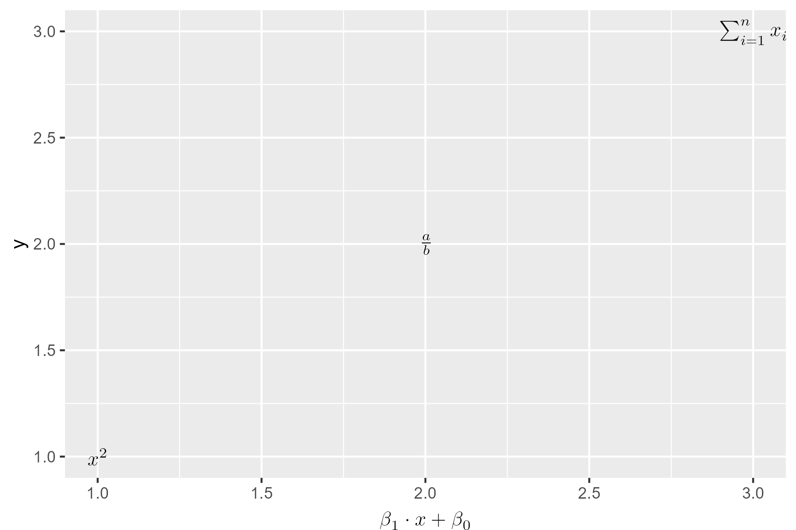
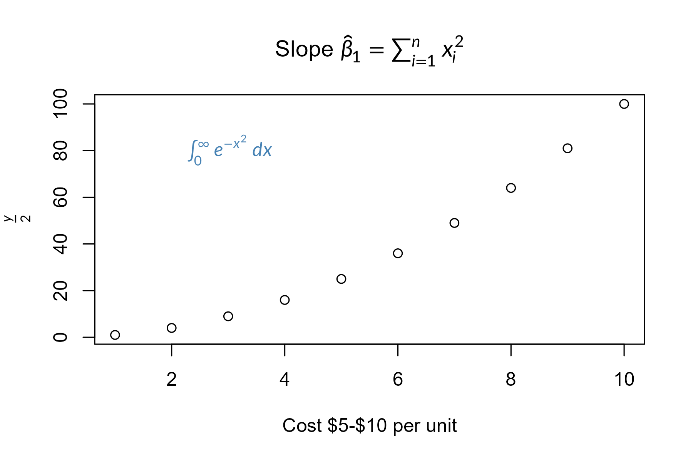

# gridmicrotex

<!-- badges: start -->
[](https://github.com/adayim/gridmicrotex/actions)
[](https://CRAN.R-project.org/package=gridmicrotex)
[](https://cran.r-project.org/package=gridmicrotex)
[](https://app.codecov.io/gh/adayim/gridmicrotex)
<!-- badges: end -->

Render LaTeX math expressions --- and markdown containing them --- as native
R **grid** graphics objects, with no external LaTeX installation required.

gridmicrotex embeds the [MicroTeX](https://github.com/NanoMichael/MicroTeX)
C++ layout engine to parse LaTeX, compute the full box model, and produce
resolution-independent vector output (paths, lines, rectangles) that works on
any R graphics device.

**Base R graphics** are covered too. `latex_options(device_math = TRUE)`
intercepts the graphics device, so `plot()` titles, axis labels, `text()`,
`mtext()` and `legend()` typeset their math with no other change to your
code. Because it acts at the device, grid, ggplot2 and lattice text is
covered as well. See [Base graphics](#base-graphics) below.

## Disclaimer
**A note on development**: This package was developed as a proof of concept for AI-assisted package creation. I designed the architecture and specification, and the core C++ integration (via [MicroTeX](https://github.com/NanoMichael/MicroTeX)) was largely facilitated by AI, with my review and oversight of the design and final outputs. I am sharing it because it works, and I hope that others will find it useful. Contributions, bug reports and improvements from the community are very welcome.


## Installation

Install the development version from GitHub:

```r
# install.packages("devtools")
devtools::install_github("adayim/gridmicrotex")
```

## Examples


``` r
library(gridmicrotex)
library(grid)

grid.newpage()
grid.latex("x = \\frac{\\textcolor{red}{-b} \\pm \\sqrt{b^{2} - 4ac}}{2a}", 
           gp = grid::gpar(fontsize = 30))
```

<div class="figure">

<p class="caption">plot of chunk example-basic</p>
</div>


By default, the input is treated as LaTeX math mode ("mixed" mode), which wraps non-math text in `\text{}` and preserves math expressions as-is. Use `$...$` or `\\(...\\)` delimiters to render math. The `"x = "` in the equation above treated as text. Use `input_mode = "math"` to treat the whole string as math mode and render text with `\\text{}`. You can change this with global option `latex_options(input_mode = "math")`.


### Composing with other grobs

The grob can be placed alongside other grid objects:


``` r
latex_options(input_mode = "math")
g <- latex_grob("\\frac{a}{b}", gp = grid::gpar(fontsize = 30))
grid.newpage()
# A blue box behind the formula
grid.rect(
  x = 0.5, y = 0.5,
  width = grobWidth(g) + unit(10, "bigpts"),
  height = grobHeight(g) + unit(10, "bigpts"),
  gp = gpar(fill = "#e8f0fe", col = "#4285f4", lwd = 2)
)

# The formula itself
grid.draw(g)
```

<div class="figure">

<p class="caption">plot of chunk example-compose</p>
</div>

### Multiple expressions


``` r
exprs <- c(
  "E = mc^{2}",
  "e^{i\\pi} + 1 = 0",
  "\\nabla \\times \\vec{E} = -\\frac{\\partial \\vec{B}}{\\partial t}",
  "\\binom{n}{k} = \\frac{n!}{k!(n-k)!}"
)

grid.newpage()
for (i in seq_along(exprs)) {
  grid.latex(
    exprs[i],
    x = unit(0.5, "npc"),
    y = unit(1 - i / (length(exprs) + 1), "npc"),
    gp = grid::gpar(fontsize = 28)
  )
}
```

<div class="figure">

<p class="caption">plot of chunk example-multiple</p>
</div>

### Mixed text and math

You can use `r"()"` raw strings to write LaTeX with regular newlines and quotes without escaping. Use `\text{}` to embed regular text within math expressions:


``` r
grid.newpage()
grid.latex(
  r"(f(x) = \begin{cases} x^2 & \text{if } x \geq 0 \\ -x & \text{otherwise} \end{cases})",
  gp = grid::gpar(fontsize = 26)
)
```

<div class="figure">

<p class="caption">plot of chunk example-mixed-definition</p>
</div>

## Markdown

`grid.markdown()` renders markdown, with `$math$` inline. Unlike the other
markdown-in-grid packages, the maths is real LaTeX rather than plotmath:


``` r
grid.newpage()
grid.markdown(
  "The **fitted** slope is $\\hat{\\beta}_1 = 0.42$ (*p* < 0.001).",
  x = 0.02, hjust = 0, gp = gpar(fontsize = 20)
)
```

<div class="figure">

<p class="caption">plot of chunk example-markdown</p>
</div>

Colour, font and size come from inline HTML, as they must: markdown itself
defines no syntax for them.


``` r
grid.newpage()
grid.markdown(
  paste0('Set in <span style="font-family:serif">serif</span>, ',
         'H<sub>0</sub> <u>rejected</u> at ',
         '<span style="color:#B22222">5%</span>.'),
  x = 0.02, hjust = 0, gp = gpar(fontsize = 20)
)
```

<div class="figure">

<p class="caption">plot of chunk example-markdown-html</p>
</div>

`markdown_box_grob()` lays out a whole document --- headings, lists, quotes,
code, tables and images --- as a stack of grobs. See
`vignette("markdown")`.


## ggplot2 integration

Use `geom_latex()` to place LaTeX labels at data coordinates, and
`element_latex()` for LaTeX-rendered axis titles:


``` r
library(ggplot2)
# Add a LaTeX table as an annotation
tab_str <- r"(\begin{tabular}{c|c} \text{A} & B^2 \\ \hline 1 & \cellcolor{#00bde5}2 \\ 3 & 4 \end{tabular})"

df <- data.frame(x = 1:3, y = 1:3,
                 eq = c("x^2", "\\frac{a}{b}", "\\sum_{i=1}^n x_i"))
ggplot(df, aes(x, y, label = eq)) + 
  geom_latex() +
  annotate("latex", x = 1, y = 2.7, label = tab_str, size = 12) +
  labs(x = "$\\beta_1 \\cdot x + \\beta_0$") +
  theme(axis.title.x = element_latex())
```

<div class="figure">

<p class="caption">plot of chunk example-ggplot2-geom</p>
</div>


ggplot2 is a soft dependency --- the core functions work without it.
See `vignette("ggplot2-integration")` for more examples.


## Base graphics

Base plots get math too. Set `latex_options(device_math = TRUE)` and any
label containing `$...$` is typeset by MicroTeX: `main`, `xlab`, `ylab`,
`text()`, `mtext()`, `legend()`, and anything built on them such as
`hist()`. Nothing else in your plotting code changes. The switch acts at
the device, so grid and ggplot2 text is covered as well.


``` r
latex_options(device_math = TRUE)

plot(1:10, (1:10)^2,
     main = "Slope $\\hat{\\beta}_1 = \\sum_{i=1}^{n} x_i^2$",
     xlab = "Cost $5-$10 per unit",   # left alone: not math
     ylab = "$\\frac{y}{2}$")
text(3, 80, "$\\int_0^\\infty e^{-x^2}\\,dx$", col = "steelblue")
```

<div class="figure">

<p class="caption">plot of chunk example-base</p>
</div>


Everyday labels are left alone, which is why the x-axis title above
renders as written. `vignette("getting-started")` gives the rule and the
limitations.


## Comparison

| Approach       | LaTeX required? | Device independent? | Math coverage | Markdown |
|:---------------|:---------------:|:-------------------:|:-------------:|:--------:|
| `tikzDevice`   | Yes             | No                  | Full          | No       |
| `xdvir`        | Yes             | No                  | Full          | No       |
| `latexpdf`     | Yes             | No                  | Full (tables) | No       |
| `latex2exp`    | No              | Yes                 | Limited       | No       |
| `plotmath`     | No              | Yes                 | Limited       | No       |
| `gridtext`     | No              | Yes                 | None          | Yes      |
| `marquee`      | No              | Yes                 | None          | Yes      |
| **gridmicrotex** | **No**       | **Yes**             | **Broad**     | **Yes**  |


## How it works

MicroTeX parses the LaTeX and computes the full TeX box model; a recorder
captures every draw operation with exact coordinates, and R turns those
into native grid primitives. Nothing is rasterised, so the output stays
sharp at any resolution on any device.

Glyphs are drawn either as native text (which keeps PDF and SVG output
selectable and searchable) or as filled vector paths, which work
everywhere. `render_mode` chooses, and falls back to paths by itself on a
device that cannot embed fonts. `vignette("getting-started")` covers the
trade-off.

## Graphics backend

The default graphics device on Windows (`windows()`) and macOS
(`quartz()`) may not find the bundled math fonts, producing warnings
like:

```
font family not found in Windows font database
```

To avoid this, switch to a modern graphics backend that uses
[systemfonts](https://CRAN.R-project.org/package=systemfonts) for font
resolution:

```r
# For knitr / R Markdown — add to your setup chunk:
knitr::opts_chunk$set(dev = "ragg_png")

# For interactive use:
options(device = function(...) ragg::agg_png(tempfile(fileext = ".png"), ...))
```

Recommended backends:

| Backend               | Format | Package               |
|:----------------------|:-------|:----------------------|
| `ragg::agg_png()`     | PNG    | [ragg](https://CRAN.R-project.org/package=ragg)       |
| `svglite::svglite()`  | SVG    | [svglite](https://CRAN.R-project.org/package=svglite) |
| `grDevices::cairo_pdf()` | PDF | Base R (Cairo build)  |

Alternatively, use `render_mode = "path"` to bypass font lookup
entirely — glyphs are drawn as vector paths, which works on all
devices but produces non-selectable text in PDF/SVG.

