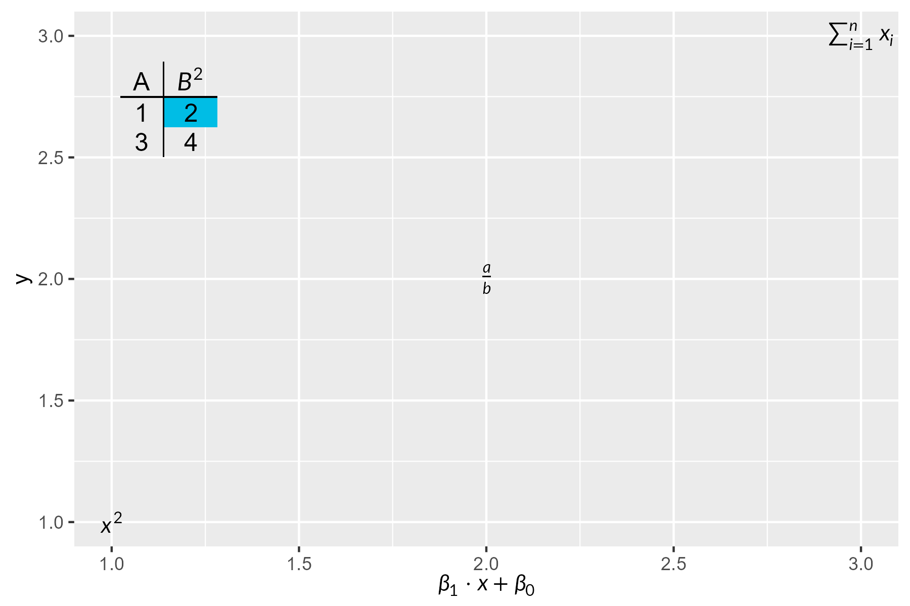

# gridmicrotex

<!-- badges: start -->

[](https://github.com/adayim/gridmicrotex/actions)
[](https://CRAN.R-project.org/package=gridmicrotex)
[](https://cran.r-project.org/package=gridmicrotex)
[](https://app.codecov.io/gh/adayim/gridmicrotex)
<!-- badges: end -->

LaTeX math and markdown for R graphics: grid, base plots and ggplot2. No
LaTeX installation needed. Built on the
[MicroTeX](https://github.com/NanoMichael/MicroTeX) layout engine.

Everything on [KaTeX’s list of supported
functions](https://katex.org/docs/supported) is drawn, and more: amsmath
and mathtools environments, equation numbers, tables from `kable()` and
gt, `tikz-cd` diagrams, `\ce{}` chemistry, and a subset of siunitx.

## Installation

``` r
install.packages("gridmicrotex")

# Development version
# install.packages("devtools")
devtools::install_github("adayim/gridmicrotex")
```

## grid

``` r
library(gridmicrotex)
library(grid)

grid.newpage()
grid.latex(r"($x = \frac{\textcolor{red}{-b} \pm \sqrt{b^2 - 4ac}}{2a}$)",
           gp = gpar(fontsize = 30))
```


Text and math mix as in LaTeX, with math between `$...$`. Use
`input_mode = "math"` for a bare formula, or `input_mode = "document"`
for paragraphs, headings and displayed equations. `latex_grob()` returns
the grob instead of drawing it.

## Base graphics

``` r
latex_options(device_math = TRUE)

plot(1:10, (1:10)^2,
     main = r"(Slope $\hat{\beta}_1 = \sum_{i=1}^{n} x_i^2$)",
     xlab = "Cost $5-$10 per unit",   # no math, drawn as written
     ylab = r"($\frac{y}{2}$)")
text(3, 80, r"($\int_0^\infty e^{-x^2}\,dx$)", col = "steelblue")
```


With `device_math = TRUE`, any label containing math is typeset: titles,
axis labels, `text()`, `legend()`, and labels in lattice and ggplot2
plots too.

## ggplot2

``` r
library(ggplot2)

tab <- r"(\begin{tabular}{c|c} A & $B^2$ \\ \hline 1 & \cellcolor{#00bde5}2 \\ 3 & 4 \end{tabular})"
df <- data.frame(x = 1:3, y = 1:3,
                 eq = c("$x^2$", r"($\frac{a}{b}$)", r"($\sum_{i=1}^n x_i$)"))

ggplot(df, aes(x, y, label = eq)) +
  geom_latex() +
  annotate("latex", x = 1.15, y = 2.7, label = tab, size = 12) +
  labs(x = r"($\beta_1 \cdot x + \beta_0$)") +
  theme(axis.title.x = element_latex())
```



## Markdown

``` r
grid.newpage()
grid.markdown(r"(The **fitted** slope is $\hat{\beta}_1 = 0.42$ (*p* < 0.001).)",
              x = 0.02, hjust = 0, gp = gpar(fontsize = 20))
```


`markdown_box_grob()` lays out whole documents: headings, lists, code,
tables and images. `geom_markdown()` and `element_markdown()` bring
markdown labels to ggplot2.

## Fonts and devices

Lete Sans Math (the default) and STIX Two Math (`math_font = "stix"`)
are included; `load_math_font()` adds others.

If the default device on Windows or macOS warns `font family not found`,
use [ragg](https://CRAN.R-project.org/package=ragg),
[svglite](https://CRAN.R-project.org/package=svglite) or `cairo_pdf()`
(in knitr: `knitr::opts_chunk$set(dev = "ragg_png")`), or set
`render_mode = "path"` to draw glyphs as outlines.

## Comparison

| Approach         | LaTeX required? | Device independent? | Math coverage | Markdown |
|:-----------------|:---------------:|:-------------------:|:-------------:|:--------:|
| `tikzDevice`     |       Yes       |         No          |     Full      |    No    |
| `xdvir`          |       Yes       |         No          |     Full      |    No    |
| `latexpdf`       |       Yes       |         No          | Full (tables) |    No    |
| `latex2exp`      |       No        |         Yes         |    Limited    |    No    |
| `plotmath`       |       No        |         Yes         |    Limited    |    No    |
| `gridtext`       |       No        |         Yes         |     None      |   Yes    |
| `marquee`        |       No        |         Yes         |     None      |   Yes    |
| **gridmicrotex** |     **No**      |       **Yes**       |   **Broad**   | **Yes**  |

## Learn more

- [Getting
  started](https://adayim.github.io/gridmicrotex/articles/getting-started.html)
- [Base R
  graphics](https://adayim.github.io/gridmicrotex/articles/base-graphics.html)
- [ggplot2](https://adayim.github.io/gridmicrotex/articles/ggplot2-integration.html)
- [Markdown](https://adayim.github.io/gridmicrotex/articles/markdown.html)
- [Documents](https://adayim.github.io/gridmicrotex/articles/documents.html)

## Disclaimer

**A note on development**: This package was developed as a proof of
concept for AI-assisted package creation. I designed the architecture
and specification, and the core C++ integration (via
[MicroTeX](https://github.com/NanoMichael/MicroTeX)) was largely
facilitated by AI, with my review and oversight of the design and final
outputs. I am sharing it because it works, and I hope that others will
find it useful. Contributions, bug reports and improvements from the
community are very welcome.
