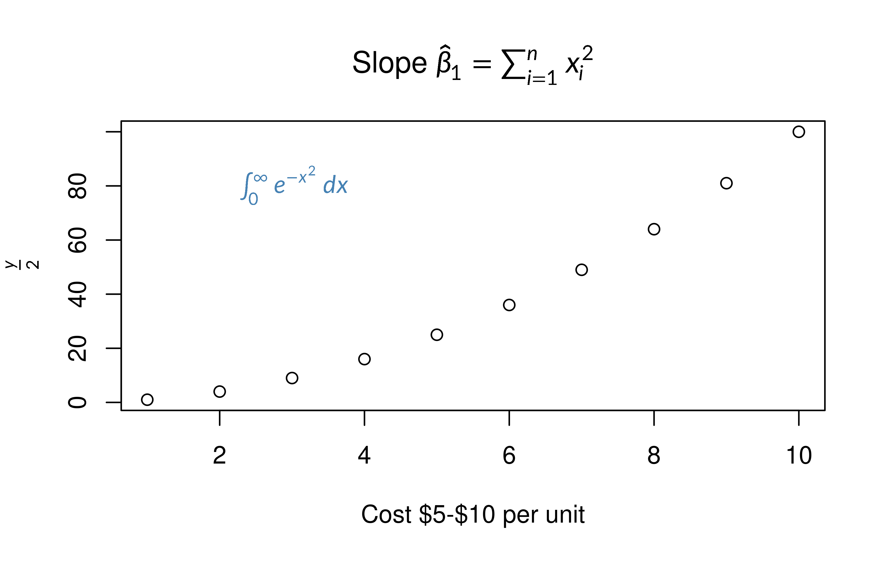
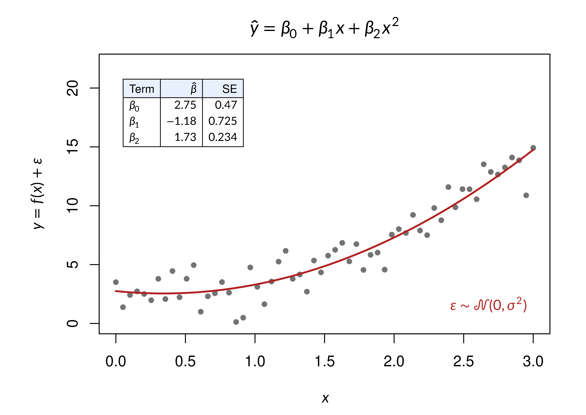

# LaTeX math in base R graphics

Turn on `latex_options(device_math = TRUE)` and any plot label written
with `$...$` is typeset as LaTeX. The rest of your plotting code stays
the same.

## A first plot

``` r

library(gridmicrotex)
library(grid)

latex_options(device_math = TRUE)

plot(1:10, (1:10)^2,
     main = r"(Slope $\hat{\beta}_1 = \sum_{i=1}^{n} x_i^2$)",
     xlab = "Cost $5-$10 per unit",
     ylab = r"($\frac{y}{2}$)")
text(3, 80, r"($\int_0^\infty e^{-x^2}\,dx$)", col = "steelblue")
```



The title, y-axis label and annotation are typeset. The x-axis label has
no math in it, so it is drawn as written.

In R Markdown, set the option in the setup chunk. If you turn it off, do
so in a later chunk than the plot, or the plot shows the literal
`$...$`.

## More than plotmath

Tables, display-style operators and other LaTeX work in any label. The
coefficient table below is drawn by an ordinary
[`text()`](https://rdrr.io/r/graphics/text.html) call:

``` r

set.seed(42)
x   <- seq(0, 3, length.out = 60)
y   <- 2 + 1.4 * x^2 + rnorm(60, sd = 1.1)
fit <- lm(y ~ poly(x, 2, raw = TRUE))
cf  <- signif(coef(summary(fit)), 3)

title_eq <- r"($$\hat{y} = \beta_0 + \beta_1 x + \beta_2 x^2$$)"

# Make room for the tall title
h   <- latex_dims(title_eq, gp = gpar(fontsize = par("ps")))$height
top <- ceiling(convertHeight(h, "bigpts", TRUE) /
               (par("cin")[2] * 72 * par("mex"))) + 2

par(mar = c(4.5, 5.5, top, 2))
plot(x, y, pch = 19, col = "grey45", cex = 0.7, ylim = c(0, 22),
     main = title_eq, xlab = r"($x$)",
     ylab = r"($y = f(x) + \varepsilon$)")
lines(x, predict(fit), col = "#B22222", lwd = 2)

# Build the table as a single line of text
tab <- sprintf(paste0(
  r"(\begin{array}{|l|r|r|}\hline)",
  r"(\rowcolor{#E8F0FE}\text{Term} & \hat{\beta} & \text{SE}\\\hline)",
  r"(\beta_0 & %s & %s\\)",
  r"(\beta_1 & %s & %s\\)",
  r"(\beta_2 & %s & %s\\\hline\end{array})"),
  cf[1, 1], cf[1, 2], cf[2, 1], cf[2, 2], cf[3, 1], cf[3, 2])

text(0.05, 18, tab, adj = c(0, 0.5), cex = 0.75)
text(2.95, 1.2, r"($\varepsilon \sim \mathcal{N}(0, \sigma^2)$)",
     adj = c(1, 0), cex = 0.95, col = "#B22222")
```



Two tips from this example:

- Keep a formula on one line. A label containing a newline is not
  recognised as math.
- Anchor a tall label by its centre (`adj = c(0, 0.5)`) and leave room
  around it; see [Tall formulas](#tall-formulas).

## Other packages

The option works for any plot drawn on an R graphics device: base plot
methods such as `plot(lm)`,
[`hist()`](https://rdrr.io/r/graphics/hist.html) and
[`legend()`](https://rdrr.io/r/graphics/legend.html), lattice, grid, and
ggplot2 (axis titles,
[`geom_text()`](https://ggplot2.tidyverse.org/reference/geom_text.html),
facet strips, legend keys). It does not reach plotly or rgl’s `text3d()`
labels.

For ggplot2,
[`geom_latex()`](https://adayim.github.io/gridmicrotex/reference/geom_latex.md)
and
[`element_latex()`](https://adayim.github.io/gridmicrotex/reference/element_latex.md)
are often the better choice; see
[`vignette("ggplot2-integration")`](https://adayim.github.io/gridmicrotex/articles/ggplot2-integration.md).

## When is a label treated as math?

A label is typeset only when every `$` in it is closed and each `$...$`
pair holds something that looks like math. Everyday dollar signs are
left alone:

| Label                                      | Rendered as |
|:-------------------------------------------|:------------|
| `"Revenue ($)"`                            | text        |
| `"Price is $5 today"`                      | text        |
| `"Cost $5-$10"`                            | text        |
| `"Budget $1,000 to $5,000 with $x$ shown"` | text        |
| `"Histogram of df$a_b - df$c_d"`           | text        |
| `"$x$"`                                    | math        |
| `"$x^2$"`                                  | math        |
| `"$y = 2x + 1$"`                           | math        |
| `"Slope $\\hat{\\beta}_1$"`                | math        |
| `"\\(\\alpha\\)"`                          | math        |

`$$...$$`, `\(...\)` and `\[...\]` also work. Write `\$` for a literal
dollar sign in a label that also has math.

## Tall formulas

Widths are measured correctly, but heights are not: R sizes margins,
titles and [`legend()`](https://rdrr.io/r/graphics/legend.html) boxes
for one line of text, so a tall formula can overflow them. Measure it
with
[`latex_dims()`](https://adayim.github.io/gridmicrotex/reference/latex_dims.md)
and widen the margin:

``` r

h  <- latex_dims(r"($\frac{a}{b}$)", gp = gpar(fontsize = par("ps")))$height
bp <- convertHeight(h, "bigpts", TRUE)

# Lines of margin needed
bp / (par("cin")[2] * 72 * par("mex"))
#> [1] 1.041667
```

Round that up and add it to the matching side of `par(mar = )`.

## Limitations

- The option applies to every plot in the session, including plots from
  other packages. Labels without math are not changed.
- Math is drawn as outlines, so it cannot be selected in a PDF or SVG.
- Bold comes from `\textbf{}`, not from the plot’s font face.
- `\includegraphics` is skipped, and rounded box corners are square.
- A label that cannot be read is drawn as plain text, without a warning.
- It does not work together with `showtext::showtext_auto()`.
- [`expression()`](https://rdrr.io/r/base/expression.html) labels are
  not affected.
- corrplot reads a label starting with `$` itself; start it with
  something else.
