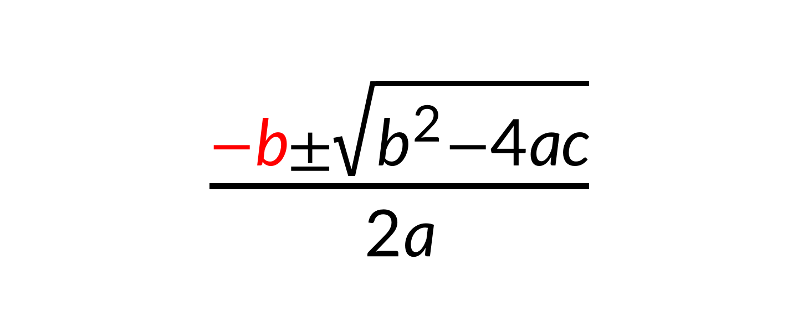
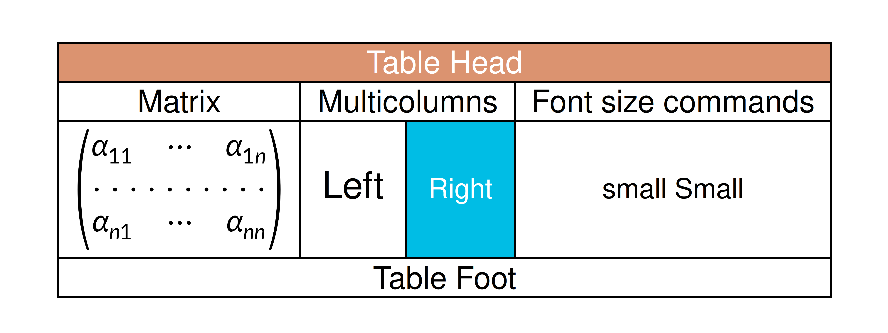
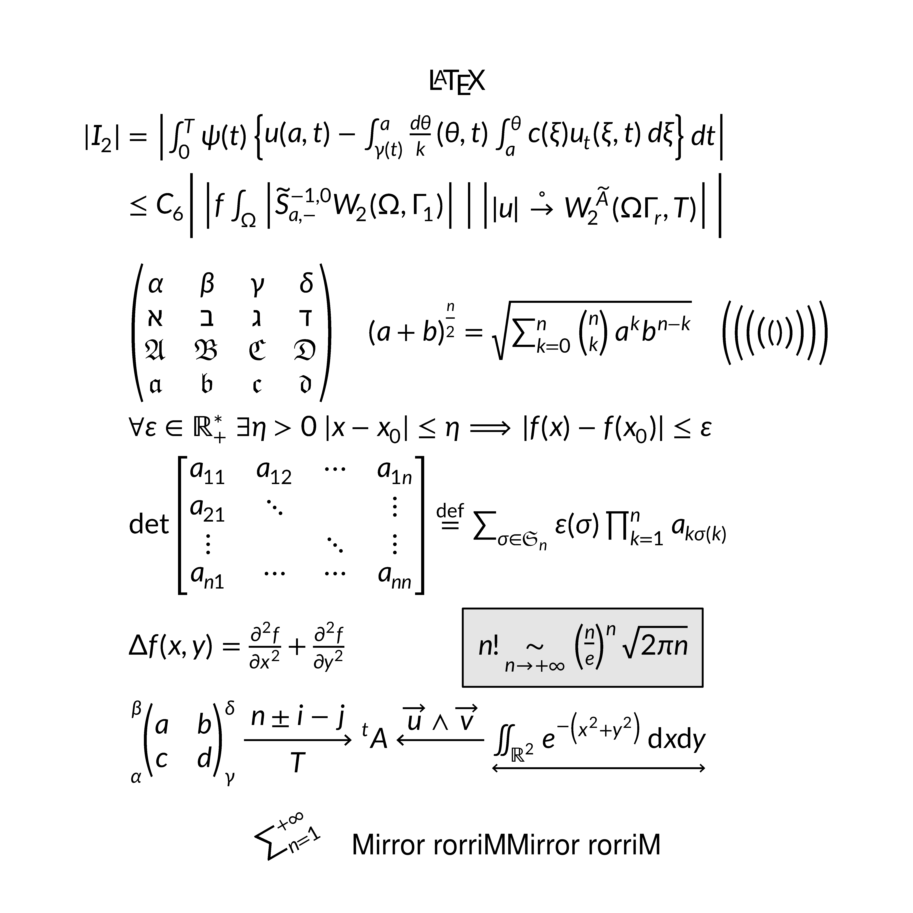
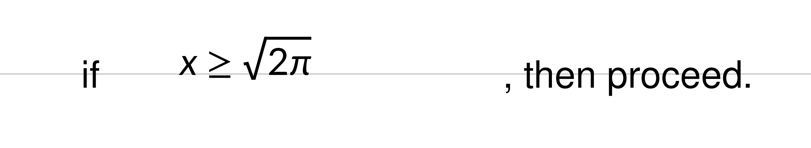
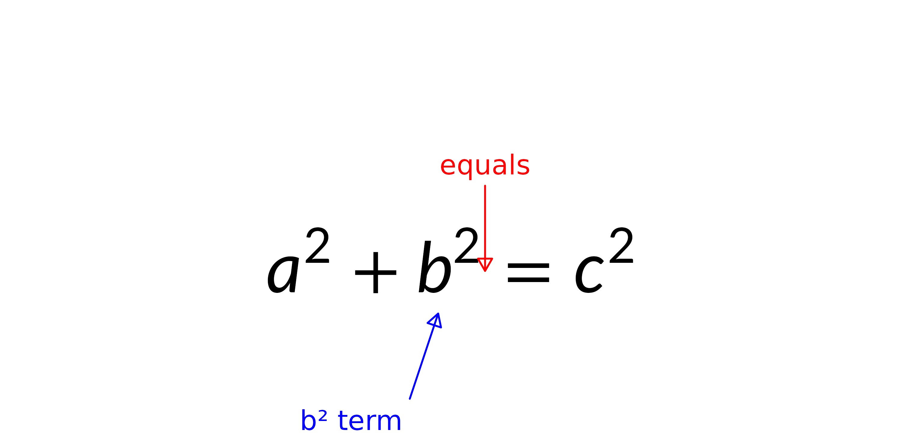
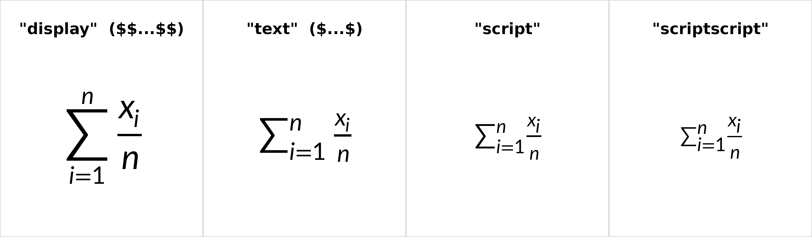

# Introduction to gridmicrotex

## What is gridmicrotex?

**gridmicrotex** renders LaTeX math as native R `grid` graphics objects.
It embeds the [MicroTeX](https://github.com/NanoMichael/MicroTeX) C++
engine: MicroTeX parses the LaTeX, builds the TeX box model and computes
exact glyph coordinates, and the package maps that layout onto grid
primitives (`pathGrob`, `segmentsGrob`, `rectGrob`, `textGrob`),
returning a `gTree`.

No LaTeX installation is required, and the result is resolution
independent on every R device.

- Full math: fractions, roots, integrals, matrices, Greek, accents,
  delimiters, and colour via `\textcolor{}`
- Two bundled math fonts, plus any OpenType math font through
  [`load_math_font()`](https://adayim.github.io/gridmicrotex/reference/load_math_font.md)
- CJK and multilingual text inside `\text{}`
- ggplot2 integration —
  [`geom_latex()`](https://adayim.github.io/gridmicrotex/reference/geom_latex.md)
  and
  [`element_latex()`](https://adayim.github.io/gridmicrotex/reference/element_latex.md),
  see
  [`vignette("ggplot2-integration")`](https://adayim.github.io/gridmicrotex/articles/ggplot2-integration.md)
- Markdown with inline math — see
  [`vignette("markdown")`](https://adayim.github.io/gridmicrotex/articles/markdown.md)

## Quick start

[`latex_grob()`](https://adayim.github.io/gridmicrotex/reference/latex_grob.md)
returns a grob;
[`grid.latex()`](https://adayim.github.io/gridmicrotex/reference/latex_grob.md)
builds and draws one.

``` r

library(gridmicrotex)
library(grid)

grid.newpage()
grid.latex(r"($\frac{\textcolor{red}{-b} \pm \sqrt{b^2 - 4ac}}{2a}$)",
           gp = gpar(fontsize = 24))
```



**Write LaTeX in a raw string.** `r"(...)"` passes backslashes through
untouched, so what you paste is what renders. Every example here uses
one. In an ordinary `"..."` string each `\` has to be doubled — and
LaTeX’s own row separator `\\` becomes a bewildering `\\\\`.

### Mixing text and math

The default `input_mode = "mixed"` reads the string as prose and
typesets only what sits inside `$…$` or `\(…\)` as math, which is why
`Famous:` below needs no markup. It saves typing, but the split is
heuristic. `input_mode = "math"` treats the whole string as math, so
prose must be wrapped in `\text{}`; that suits heavy math and pasted
LaTeX. These two render identically:

``` r

grid.newpage()
grid.latex(r"(Famous: $E = mc^2$)",
           x = 0.05, y = 0.7, hjust = 0, gp = gpar(fontsize = 22))
grid.latex(r"(\text{Famous: } E = mc^2)", input_mode = "math",
           x = 0.05, y = 0.3, hjust = 0, gp = gpar(fontsize = 22))
```


Set the mode for a whole session with `latex_options(input_mode = )`.

## What it can render

Two figures before the details, because the range is easier to see than
to describe. A coloured `array` with `\multicolumn`, `\rowcolor`,
`\cellcolor`, a custom column type and a nested matrix:

``` r

grid.newpage()
grid.latex(r"(
\newcolumntype{s}{>{\color{#1234B6}}c}
\begin{array}{|c|c|c|s|}
  \hline
  \rowcolor{Tan}\multicolumn{4}{|c|}{\textcolor{white}{\bold{\text{Table Head}}}}\\
  \hline
  \text{Matrix}&\multicolumn{2}{|c|}{\text{Multicolumns}}&\text{Font size commands}\\
  \hline
  \begin{pmatrix}
      \alpha_{11}&\cdots&\alpha_{1n}\\
      \hdotsfor{3}\\
      \alpha_{n1}&\cdots&\alpha_{nn}
  \end{pmatrix}
  &\large \text{Left}&\cellcolor{#00bde5}\small \textcolor{white}{\text{\bold{Right}}}
  &\small \text{small Small}\\
  \hline
  \multicolumn{4}{|c|}{\text{Table Foot}}\\
  \hline
\end{array}
)", gp = gpar(fontsize = 22))
```



And a page of assorted notation — `split` alignment, fraktur, stacked
delimiters, `\sideset`, extensible arrows, `\rotatebox`, `\reflectbox`
and a boxed result:

``` r

grid.newpage()
grid.latex(r"(
\definecolor{gris}{gray}{0.9}
\definecolor{noir}{rgb}{0,0,0}
\fatalIfCmdConflict{false}
\newcommand{\pa}{\left|}
\begin{array}{c}
  \LaTeX\\
  \begin{split}
      |I_2| &= \pa\int_0^T\psi(t)\left\{ u(a,t)-\int_{\gamma(t)}^a \frac{d\theta}{k} (\theta,t) \int_a^\theta c(\xi)
          u_t (\xi,t)\,d\xi\right\}dt\right|\\
      &\le C_6 \Bigg|\pa f \int_\Omega \pa\widetilde{S}^{-1,0}_{a,-}
          W_2(\Omega, \Gamma_1)\right|\ \right|\left| |u|\overset{\circ}{\to} W_2^{\widetilde{A}}(\Omega\Gamma_r,T)\right|\Bigg|\\
      &\\
      &\begin{pmatrix}
          \alpha&\beta&\gamma&\delta\\
          \aleph&\beth&\gimel&\daleth\\
          \mathfrak{A}&\mathfrak{B}&\mathfrak{C}&\mathfrak{D}\\
          \boldsymbol{\mathfrak{a}}&\boldsymbol{\mathfrak{b}}&\boldsymbol{\mathfrak{c}}&\boldsymbol{\mathfrak{d}}
      \end{pmatrix}
      \quad{(a+b)}^{\frac{n}{2}}=\sqrt{\sum_{k=0}^n\tbinom{n}{k}a^kb^{n-k}}\quad
          \Biggl(\biggl(\Bigl(\bigl(()\bigr)\Bigr)\biggr)\Biggr)\\
      &\forall\varepsilon\in\mathbb{R}_+^*\ \exists\eta>0\ |x-x_0|\leq\eta\Longrightarrow|f(x)-f(x_0)|\leq\varepsilon\\
      &\det
      \begin{bmatrix}
          a_{11}&a_{12}&\cdots&a_{1n}\\
          a_{21}&\ddots&&\vdots\\
          \vdots&&\ddots&\vdots\\
          a_{n1}&\cdots&\cdots&a_{nn}
      \end{bmatrix}
      \overset{\mathrm{def}}{=}\sum_{\sigma\in\mathfrak{S}_n}\varepsilon(\sigma)\prod_{k=1}^n a_{k\sigma(k)}\\
      &\Delta f(x,y)=\frac{\partial^2f}{\partial x^2}+\frac{\partial^2f}{\partial y^2}\qquad\qquad \fcolorbox{noir}{gris}
          {n!\underset{n\rightarrow+\infty}{\sim} {\left(\frac{n}{e}\right)}^n\sqrt{2\pi n}}\\
      &\sideset{_\alpha^\beta}{_\gamma^\delta}{
      \begin{pmatrix}
          a&b\\
          c&d
      \end{pmatrix}}
      \xrightarrow[T]{n\pm i-j}\sideset{^t}{}A\xleftarrow{\overrightarrow{u}\wedge\overrightarrow{v}}
          \underleftrightarrow{\iint_{\mathds{R}^2}e^{-\left(x^2+y^2\right)}\,\mathrm{d}x\mathrm{d}y}
  \end{split}\\
  \rotatebox{30}{\sum_{n=1}^{+\infty}}\quad\mbox{Mirror rorriM}\reflectbox{\mbox{Mirror rorriM}}
\end{array}
)", gp = gpar(fontsize = 22), render_mode = "path")
```



Both are ordinary LaTeX, pasted unchanged. The rest of this vignette is
about placing such things, choosing fonts, and knowing where the
supported set ends.

## Placing formulas

`x`, `y`, `hjust` and `vjust` work as they do anywhere in grid.

``` r

grid.newpage()
grid.latex(r"($E = mc^2$)", x = 0.05, y = 0.7, hjust = 0,
           gp = gpar(fontsize = 22))
grid.latex(r"($F = ma$)", x = 0.95, y = 0.3, hjust = 1,
           gp = gpar(fontsize = 22))
```


### Aligning to the math baseline

`hjust` and `vjust` also take names. The useful one is
`vjust = "baseline"`, which puts the formula’s *math baseline* — not the
bounding-box centre — on the anchor, so a formula sits beside running
text the way it would in a typeset document.

``` r

grid.newpage()
y <- 0.5
grid.segments(unit(0, "npc"), unit(y, "npc"),
              unit(1, "npc"), unit(y, "npc"), gp = gpar(col = "grey80"))
grid.text("if ", x = 0.10, y = y, just = c(0, 0.5), gp = gpar(fontsize = 16))
grid.latex(r"($x \geq \sqrt{2\pi}$)",
           x = 0.22, y = y, hjust = "left", vjust = "baseline",
           gp = gpar(fontsize = 16))
grid.text(", then proceed.", x = 0.62, y = y, just = c(0, 0.5),
          gp = gpar(fontsize = 16))
```



`hjust` accepts `"left"`/`"bbleft"`, `"center"`/`"centre"`/`"middle"`/
`"bbcentre"`, and `"right"`/`"bbright"`. `vjust` accepts `"bottom"`,
`"center"`/`"centre"`/`"middle"`, `"top"`, and `"baseline"`.

### Named anchors with `\mark{}`

`\mark{name}` records a named anchor inside the formula, and
[`grobMark()`](https://adayim.github.io/gridmicrotex/reference/grobMark.md)
resolves it to a pair of grid units ready to drive an arrow or a
callout. Marks work at any nesting level — even inside a superscript or
a fraction — and inherit the surrounding transform (font shrink,
scaling, rotation), so the anchor lands on the rendered glyph.

``` r

g <- latex_grob(r"($a^2 + b\mark{term}^2 \mark{equals}= c^2$)",
                x = 0.5, y = 0.4, gp = gpar(fontsize = 28))
grid.newpage()
grid.draw(g)

# The "=" sign, pointed at from above.
mk_eq <- grobMark(g, "equals")
grid.segments(mk_eq$x, mk_eq$y + unit(15, "mm"),
              mk_eq$x, mk_eq$y + unit(3, "mm"),
              arrow = arrow(length = unit(2, "mm"), type = "closed"),
              gp = gpar(col = "red"))
grid.text("equals", x = mk_eq$x, y = mk_eq$y + unit(18, "mm"),
          gp = gpar(col = "red", fontsize = 11))

# The b^2 term, from below -- the mark sits at the end of the term,
# including the superscript's smaller scale.
mk_bsq <- grobMark(g, "term")
grid.segments(mk_bsq$x - unit(6, "mm"), mk_bsq$y - unit(15, "mm"),
              mk_bsq$x - unit(2, "mm"), mk_bsq$y - unit(3, "mm"),
              arrow = arrow(length = unit(2, "mm"), type = "closed"),
              gp = gpar(col = "blue"))
grid.text("b² term", x = mk_bsq$x - unit(7, "mm"),
          y = mk_bsq$y - unit(18, "mm"), just = "right",
          gp = gpar(col = "blue", fontsize = 11))
```



The returned units carry the grob’s viewport position and
`hjust`/`vjust`, so they go straight into any grid drawing function with
no offset arithmetic. A mark is a single point, not a span: to centre a
callout over a multi-glyph term, use a pair (`\mark{l}…\mark{r}`) and
take the midpoint.

## Display and inline style

TeX sets the same expression two ways. In *display* style a `\sum` is
drawn at full size with its limits above and below; in *text* (inline)
style it shrinks and the limits become scripts beside it. This is a
choice about spacing and layout, not about size — size is always
`gp$fontsize`.

By default the delimiters decide, exactly as in a LaTeX document: `$…$`
gives text style and `$$…$$` gives display style. A label written
without delimiters — a plot title, an axis title, an
[`element_latex()`](https://adayim.github.io/gridmicrotex/reference/element_latex.md)
— has nothing for the parser to go on, so it gets text style.
`tex_style` overrides that for the whole expression, and takes all four
of TeX’s styles:

``` r

sum_expr <- r"(\sum_{i=1}^{n} \frac{x_i}{n})"
styles <- c("display", "text", "script", "scriptscript")
labels <- c('"display"  ($$...$$)', '"text"  ($...$)',
            '"script"', '"scriptscript"')

grid.newpage()
for (i in seq_along(styles)) {
  pushViewport(viewport(x = (i - 0.5) / 4, width = 1 / 4))
  grid.text(labels[i], y = 0.88, gp = gpar(cex = 0.75, fontface = "bold"))
  grid.latex(sum_expr, y = 0.42, input_mode = "math",
             tex_style = styles[i], gp = gpar(fontsize = 20))
  grid.rect(gp = gpar(col = "grey85", fill = NA))
  popViewport()
}
```



Every panel is `gp = gpar(fontsize = 20)`. The display version is taller
and narrower because the limits moved above and below the operator
instead of sitting beside it — worth knowing when you are budgeting
space for a label, and
[`latex_dims()`](https://adayim.github.io/gridmicrotex/reference/latex_dims.md)
reports the difference if you need the numbers. `"script"` and
`"scriptscript"` are the sizes TeX uses for first- and second-level
scripts; they are occasionally handy for a compact sub-label, and rarely
needed otherwise.

To change style for part of an expression rather than all of it, use the
inline commands `\displaystyle`, `\textstyle`, `\scriptstyle` and
`\scriptscriptstyle` instead. `latex_options(tex_style = )` sets a
session default.

## Including a figure

`\includegraphics` draws an image inside the formula. PNG, JPEG and SVG
are supported, sized with `width`, `height` or `scale` in any LaTeX
length; give one of width/height and the aspect ratio is kept, or both
plus `keepaspectratio` to fit inside them. As in LaTeX the extension may
be omitted (`{plots/fig}` finds `plots/fig.svg` or `plots/fig.png`), and
`\graphicspath{{figs/}}` adds a directory to search. `angle` rotates the
figure, like `\rotatebox`; `trim` and `clip` are recognised but not
applied, and say so.

``` r

fig <- tempfile(fileext = ".svg")
svglite::svglite(fig, width = 2, height = 1.2)
grid.newpage()
grid.circle(r = 0.35, gp = gpar(fill = "steelblue", col = NA))
dev.off()
#> agg_png 
#>       2

grid.newpage()
grid.latex(sprintf(r"(\text{before }\includegraphics[width=1in]{%s}\text{ after})", fig),
           input_mode = "math", gp = gpar(fontsize = 16))
```


Inline, the image sits **on the baseline**, as in LaTeX — `\raisebox`
moves it. A paragraph holding only an image is a **block**, flush left
unless `halign` or a `text-align` rule on `img` says otherwise.

``` r

icon <- sprintf(r"(\includegraphics[width=14bp]{%s})", fig)
grid.newpage()
grid.latex(sprintf(r"(\text{baseline }%s\text{, raised }\raisebox{4bp}{%s})",
                   icon, icon),
           input_mode = "math", gp = gpar(fontsize = 18))
```


### A caption

`\caption` renders where it is written. A caption after
`\includegraphics` therefore sits below the figure, and one written
before a `tabular` sits above the table — which is what makes raw
`xtable` and `kable` output come out the right way round without any
float logic.

`\centering` is dropped, because a grob has no page to centre against. A
one-column `array` does the job instead: it centres the figure and its
caption on each other.

``` r

logo <- system.file("img", "Rlogo.png", package = "png")
grid.newpage()
grid.latex(sprintf(r"(\begin{array}{c}
  \includegraphics[width=0.6in]{%s}\\
  \caption{Figure 1: the R logo}
\end{array})", logo), gp = gpar(fontsize = 11))
```


Remove the `array` and the same two lines come out flush left. LaTeX
numbers captions from a counter; here the number is yours to write.

**Prefer SVG.** An SVG is drawn as real grid primitives, so it stays
sharp at any output resolution — there is no dpi to choose. A PNG or
JPEG is a fixed grid of pixels, so if you display one much larger than
it was saved you get a blurry result; the package warns when the
effective resolution falls below 150 dpi and tells you what pixel size
would reach 300. The rule is `pixels = display_inches * output_dpi`.

PDF and EPS are **not** supported. Save the figure as SVG instead: it
needs no external tool and, unlike a rasterised PDF, its text stays
text.

## Fonts

Two layers are in play. **MicroTeX** chooses the math glyphs and their
metrics; **grid** draws everything inside `\text{}` using
`gp$fontfamily`, so prose follows R’s ordinary font handling — Latin,
CJK, Cyrillic and anything else the device supports.

Two math fonts ship with the package and load automatically:

| Alias              | Font           | Style      | Pairs with             |
|--------------------|----------------|------------|------------------------|
| `"lete"` (default) | Lete Sans Math | Sans-serif | `fontfamily = "sans"`  |
| `"stix"`           | STIX Two Math  | Serif      | `fontfamily = "serif"` |

``` r

available_math_fonts()
#> [1] "DejaVu Sans"    "Lete Sans Math" "STIX Two Math"
```

Set one per call with `math_font`, or for the session with
`latex_options(math_font = )`. Both rows below are the same formula —
only the math font and its paired text family differ:

``` r

formula <- r"(Theorem: $\int_0^1 f(x)\,dx \geq 0$)"

grid.newpage()
pushViewport(viewport(layout = grid.layout(2, 1)))
pushViewport(viewport(layout.pos.row = 1))
grid.latex(formula, gp = gpar(fontsize = 15, fontfamily = "sans"))
upViewport()
pushViewport(viewport(layout.pos.row = 2))
grid.latex(formula, math_font = "stix",
           gp = gpar(fontsize = 15, fontfamily = "serif"))
upViewport(2)
```


[`check_math_fonts()`](https://adayim.github.io/gridmicrotex/reference/check_math_fonts.md)
gives a diagnostic report. Any font available to R works for the text
half — base families like `"sans"`, `"serif"` and `"mono"`, or anything
registered through **systemfonts**:

``` r

grid.newpage()
grid.latex(r"(如果 $x > 0$ 则 $y = x^2$)",
           gp = gpar(fontsize = 24, fontfamily = "sans"))
```


### Naming a font for one run

`gp$fontfamily` applies to the whole grob. For a *single run*, use
`\gmfontfamily{family}{content}` — a gridmicrotex extension, not
standard LaTeX. `\textrm{…}` goes the other way, returning content to
`gp$fontfamily` even inside a `\textsf{…}`, `\texttt{…}` or
`\gmfontfamily{…}{…}` group, and without disturbing bold or italic:

``` r

grid.newpage()
grid.latex(
  r"(\textsf{sans \textrm{body} sans} \quad \gmfontfamily{mono}{mono})",
  gp = gpar(fontsize = 16, fontfamily = "serif")
)
```


`family` is anything `gp$fontfamily` accepts: a generic (`"sans"`,
`"serif"`, `"mono"`) or a specific name such as `"Georgia"`, which
`\textsf{…}` / `\texttt{…}` cannot express. Unresolvable names fall back
silently. The content is typeset as text, so this styles prose, not math
— math glyphs follow `math_font`. It composes with emphasis in either
nesting order, but a nested `\gmfontfamily` *replaces* the family it
sits inside.

The name is deliberately not `\fontfamily`: LaTeX’s takes one argument,
does nothing until `\selectfont`, and wants an NFSS code (`ptm`) rather
than a font name. Since gridmicrotex accepts pasted LaTeX, claiming that
name would silently misparse real input. This is also what markdown’s
`font-family` CSS compiles to — see
[`vignette("markdown")`](https://adayim.github.io/gridmicrotex/articles/markdown.md).

### Loading a custom math font

[`load_math_font()`](https://adayim.github.io/gridmicrotex/reference/load_math_font.md)
adds any OpenType math font. The OpenType MATH table is parsed directly
in C++, so no companion metrics file and no external toolchain are
needed:

``` r

load_math_font("path/to/MyFont.otf")
```

This is only for **math** fonts. Text fonts need no loading at all — set
`gp$fontfamily`, or name one for a run with `\gmfontfamily{}{}`.

## Devices and render modes

- **`"typeface"`** (default) draws glyphs as native text, so PDF and SVG
  output stays selectable and searchable: a line of prose is emitted as
  a single element, so a viewer finds a phrase and not merely a word.
  Text given a `max_width` is the exception — it is emitted one word per
  element, because the spaces are where the lines break. Fonts are read
  straight from their OTF files, with no system-wide install — but this
  needs a device with the R 4.3 glyph engine (`ragg`, `svglite`,
  `cairo_pdf`). On others, such as the base
  [`pdf()`](https://rdrr.io/r/grDevices/pdf.html) device, it falls back
  to path mode with a warning.
- **`"path"`** draws each glyph as a filled vector path. Works on every
  device; the text is not selectable, and files are larger.

``` r

grid.latex(r"($E = mc^2$)", gp = gpar(fontsize = 24))                        # typeface
grid.latex(r"($E = mc^2$)", gp = gpar(fontsize = 24), render_mode = "path")  # path
```

Prefer
[`ragg::agg_png()`](https://ragg.r-lib.org/reference/agg_png.html),
[`svglite::svglite()`](https://svglite.r-lib.org/reference/svglite.html)
or [`grDevices::cairo_pdf()`](https://rdrr.io/r/grDevices/cairo.html).
The default devices on Windows and macOS may not find the bundled math
fonts and will warn `font family not found in Windows font database`;
the README covers the setup, and compares the package with `tikzDevice`,
`xdvir`, `latex2exp` and `plotmath`.

> **Do not use `showtext::showtext_auto()` with typeface mode.**
> showtext intercepts all text rendering and converts it to paths,
> silently defeating typeface mode even on `svglite` and `ragg`. Call
> `showtext::showtext_auto(FALSE)` before drawing formulas.

## Utilities

### Measuring

[`latex_dims()`](https://adayim.github.io/gridmicrotex/reference/latex_dims.md)
returns the bounding box of an expression, for layout arithmetic and for
checking that a label fits:

``` r

latex_dims(r"(\frac{a}{b})", gp = gpar(fontsize = 20))
#> $width
#> [1] 7bigpts
#> 
#> $height
#> [1] 25bigpts
#> 
#> $depth
#> [1] 9bigpts
#> 
#> $baseline
#> [1] 9.36317294836044bigpts
#> 
#> $is_split
#> [1] FALSE
```

### Session defaults

[`latex_options()`](https://adayim.github.io/gridmicrotex/reference/latex_options.md)
sets `math_font`, `render_mode` and `input_mode` for calls that don’t
supply them; explicit arguments always win. Size stays at the grob
level, via `gp$fontsize` / `gp$lineheight`.

``` r

latex_options(math_font = "stix", render_mode = "typeface")
latex_options()        # query
reset_latex_options()  # back to built-in defaults
```

### User-defined macros

[`define_macro()`](https://adayim.github.io/gridmicrotex/reference/define_macro.md)
registers zero-argument shorthands, expanded by text substitution before
the expression reaches MicroTeX:

``` r

define_macro("RR", r"(\mathbb{R})")
define_macro("eps", r"(\varepsilon)")

grid.newpage()
grid.latex(r"(\forall \eps > 0, \eps \in \RR)", gp = gpar(fontsize = 24))
```


``` r


clear_macros()
```

Names must be ASCII letters, and expansion iterates to a fixed point so
macros can reference each other.
[`list_macros()`](https://adayim.github.io/gridmicrotex/reference/define_macro.md)
shows what is registered;
[`clear_macros()`](https://adayim.github.io/gridmicrotex/reference/define_macro.md)
drops everything.

For parameterised macros (0–9 arguments) MicroTeX also accepts plain-TeX
`\def`. These live only for the expression they appear in, so use them
for an abbreviation local to one label and
[`define_macro()`](https://adayim.github.io/gridmicrotex/reference/define_macro.md)
for one that should persist:

``` r

grid.newpage()
grid.latex(
  r"(\def\norm#1{\left\lVert #1 \right\rVert}
      \norm{\vec{v}} = \sqrt{\langle \vec{v}, \vec{v} \rangle})",
  gp = gpar(fontsize = 24)
)
```


### Caching and introspection

Parsed layouts are memoised by
`(tex, fontsize, math_font, render_mode, …)`, so a repeated axis label
is laid out once:

``` r

latex_cache_info()       # size / max_size / hits / misses
latex_cache_limit(1024)  # LRU capacity; 0 disables caching
latex_cache_clear()      # wipe (e.g. after re-loading fonts)
```

[`latex_tree()`](https://adayim.github.io/gridmicrotex/reference/latex_tree.md)
returns the raw draw records plus bbox metadata, and `debug = TRUE`
overlays the bounding box, baseline and record origins — both useful
when checking alignment:

``` r

grid.newpage()
grid.latex(r"($x^{2} + y_{i}$)", gp = gpar(fontsize = 30), debug = TRUE)
```


## LaTeX reference

MicroTeX is a **math formula renderer**, not a document typesetter. It
covers the vast majority of notation used in plots and figures, but does
not replace a LaTeX installation. This section is the boundary.

### Lists

`itemize` and `enumerate` lay their items out as a left-aligned column,
one per row — `itemize` prefixes a bullet, `enumerate` numbers them:

``` r

grid.newpage()
grid.latex(r"(\begin{enumerate}
  \item e^{i\pi} + 1 = 0
  \item \begin{itemize}
          \item \alpha \item \beta
        \end{itemize}
\end{enumerate})", gp = gpar(fontsize = 20))
```


An optional `[…]` argument customises the marker. For `itemize` it is
the literal marker (`\begin{itemize}[\star]`); for `enumerate` it is a
counter template containing one of `\arabic*`, `\alph*`, `\Alph*`,
`\roman*` or `\Roman*` (e.g. `\begin{enumerate}[\Roman*.]`). Lists nest,
and an item may contain any math, including a `\begin{array}` table.

Because MicroTeX is a math engine, each item is a **math-mode,
single-line** expression: no paragraph flow, no line wrapping, and prose
inside an item needs `\text{}` (`\item \text{First point}`). The
`description` environment is not supported.

### Pasting LaTeX from other sources

Input generated by other tools — ready-to-compile `tabular` snippets,
fragments copied out of a `.tex` file — usually arrives wrapped in
document-level constructs MicroTeX does not implement. Rather than
refusing it, gridmicrotex rewrites or removes a small set of well-known
wrappers before parsing, so `knitr::kable(format = "latex")` and
`xtable::print.xtable()` output can be pasted in unedited:

``` r

snippet <- r"(
% latex table generated by kable()
\begin{table}[ht]
\centering
\caption{Model coefficients}
\begin{tabular}{lrr}
\toprule
Term & Estimate & \emph{p} \\
\midrule
Intercept & 2.14 & 0.003 \\
Slope & 0.42 & 0.001 \\
\bottomrule
\end{tabular}
\end{table}
)"

grid.newpage()
grid.latex(snippet, input_mode = "mixed", gp = gpar(fontsize = 11))
```


Six things were handled without any editing: the `%` comment and the
`table` float were dropped, `\centering` removed, `\caption` set as a
line above the table, `\toprule`/`\bottomrule` became thick rules,
`\midrule` a plain one, and `\emph` became italic.

Note that the cell text is set in math italics. A `tabular` is a math
environment, so its contents are math whichever `input_mode` you choose
— the two modes give an identical layout for the snippet above. What
`"mixed"` buys you here is the prose *outside* the environment, such as
the caption. For upright cell text, wrap the cells in `\text{}`.

**Removed silently (no visual effect):**

| Construct | Why |
|----|----|
| `%`-to-end-of-line comments (`\%` is preserved) | comments are non-visual in LaTeX too |
| `\documentclass[…]{…}`, `\usepackage[…]{…}` | preamble metadata |
| `\begin{document}` / `\end{document}` | document boundary, structural only |
| `\maketitle`, `\title{…}`, `\author{…}` | title-page metadata, no body output |
| `\label{…}` | cross-reference target, never rendered in LaTeX either |
| `\begin{table}[…]` / `\end{table}`, `\begin{figure}[…]` / `\end{figure}` (and starred variants) | float wrappers; the contents stay |
| `\centering`, `\raggedright`, `\raggedleft`, `\flushleft`, `\flushright` | alignment scope declarations |
| `\noindent`, `\relax` | content-free declarations |

**Rewritten to a MicroTeX equivalent:**

| Construct | Becomes |
|----|----|
| `\emph{X}` | `\textit{X}` |
| `\textnormal{X}` | `\text{X}` |
| `\par`, `\newline` | `\\` (line break) |
| `\toprule`, `\bottomrule` | `\thickhline` (rendered ~2× thickness) |
| `\midrule` | `\hline` |
| `\cmidrule[trim]?(parenarg)?{a-b}` | `\cline{a-b}` — partial-column rule |
| `\caption[short]{X}` | `\text{X}` plus a line break, at its source position — so a caption written above the table stays above it |
| `\smallskip`, `\medskip`, `\bigskip` | `\vspace{0.25em}` / `\vspace{0.5em}` / `\vspace{1em}` — em-relative so they scale with `gp$fontsize` |
| `\hfill`, `\vfill` | `\quad` / `\vspace{1em}` — static proxies for rubber lengths |
| `\url{X}` | coloured monospace text — a grob cannot be a hyperlink, so only the appearance survives |
| `\href{U}{X}` | `X`, coloured. Matches `hyperref` with `colorlinks=true`; markdown links use HTML’s blue-and-underlined convention instead |

Three of those are approximations. `\caption` renders where it appears
in the source, not where LaTeX’s float machinery would move it, so
caption-above or caption-below follows whatever your tool emits. The
skips are em-relative rather than LaTeX’s absolute 3/6/12 pt, so they
stay visible at any `gp$fontsize`; use `\vspace{Xpt}` for an exact
amount. And `\hfill` / `\vfill` are *rubber* lengths with nothing to
fill in a fixed-size grob, so they become a static 1 em gap — right
position, no elasticity.

**Not honored** — rendered as literal text, which is intentional: it
makes unsupported markup easy to spot.

- Declarative font scopes: `\bfseries`, `\itshape`, `\ttfamily`,
  `\sffamily`, `\rmfamily`. These affect text within their group in
  LaTeX, which needs scope tracking we do not implement. Use the
  argument-bearing forms instead — `\textbf{…}`, `\textit{…}`,
  `\texttt{…}`, `\textsf{…}`, `\textrm{…}` — all of which nest. To
  choose the text font itself, set `gp$fontfamily` or use
  `\gmfontfamily{…}{…}`.
- References: `\ref{…}`, `\cite{…}` — there is nothing to resolve
  against.
- Footnotes: `\footnote{…}` — the positioning machinery is page-bound.
- Small caps: `\textsc{…}` — MicroTeX has no small-caps glyphs.

### What is not supported

These need a real document compiler and are outside a formula renderer’s
scope: document structure (`\section`, page layout, `\tableofcontents`);
automatic hyphenation (`\-` marks a break point yourself, and
`max_width` / `justify` do handle line breaking); TikZ/PGF;
cross-references and bibliographies; theorem environments; the
`description` list environment (`itemize` and `enumerate` *are*
supported); and `\tag` / equation numbering. `\usepackage{…}` is
accepted but loads nothing — every supported command is built into
MicroTeX.

For axis labels, annotations, legends and in-plot formulas, the
supported set is more than sufficient.
