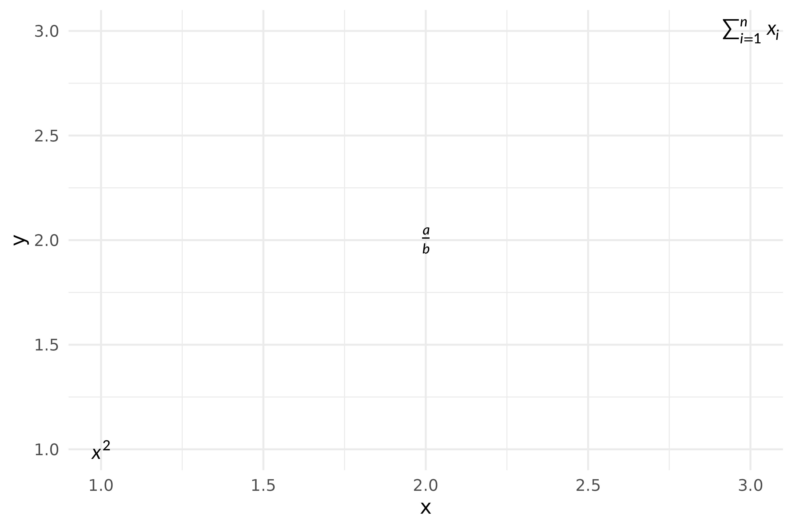
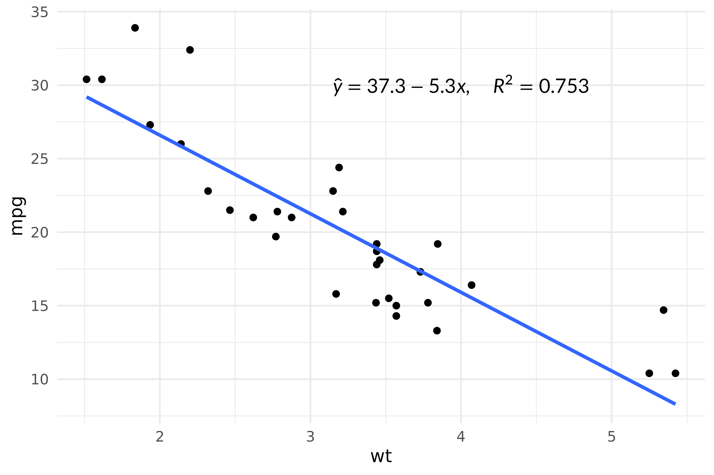
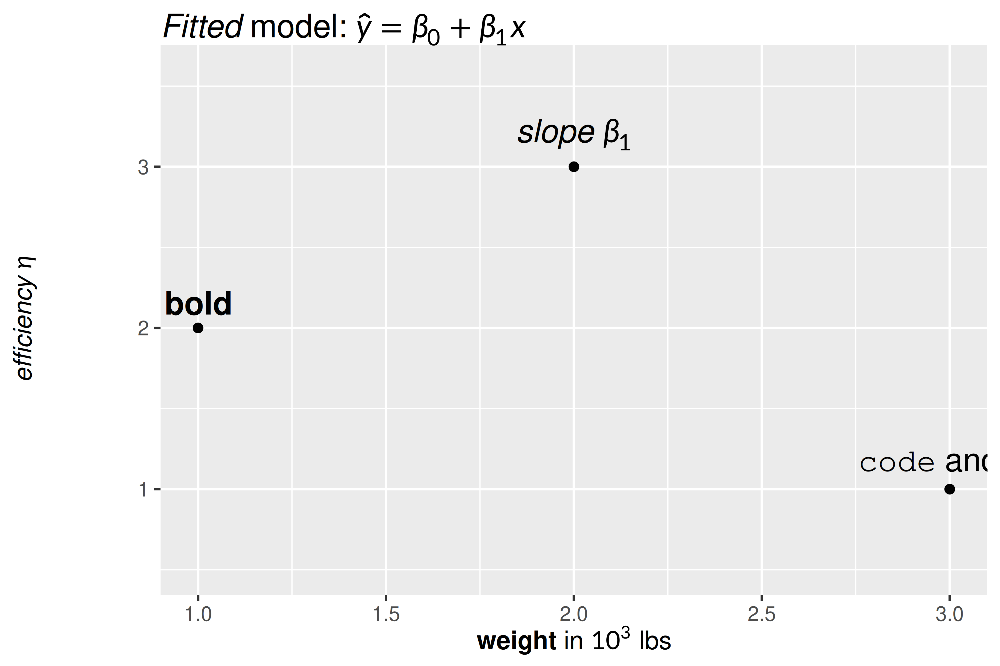
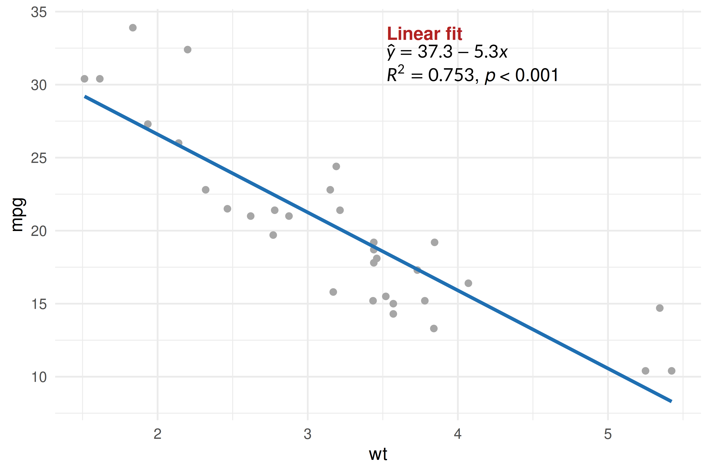
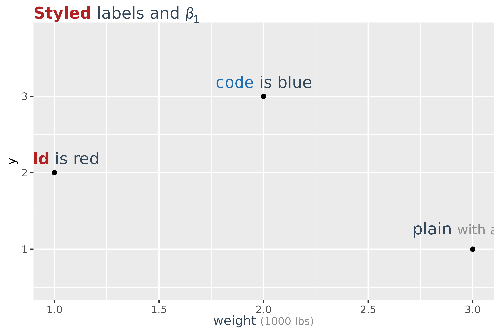
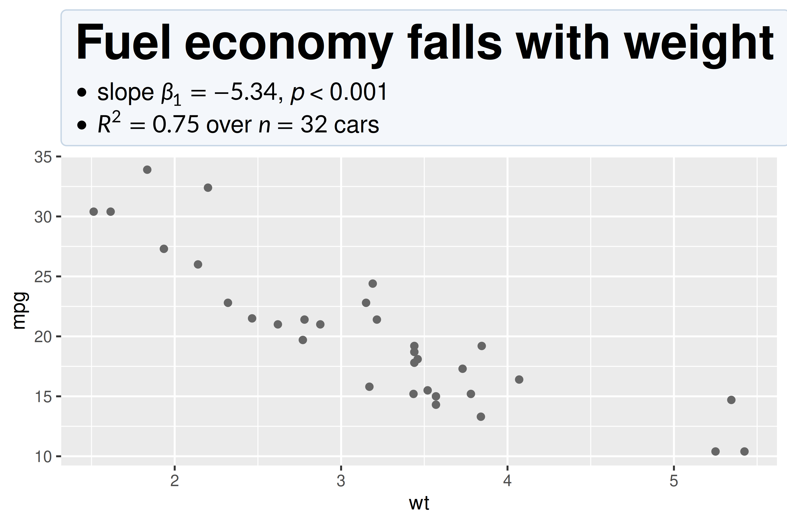

# Using LaTeX Math in ggplot2

gridmicrotex provides ggplot2 extensions for rendering LaTeX math in
plots:

- **[`geom_latex()`](https://adayim.github.io/gridmicrotex/reference/geom_latex.md)**
  — a geom layer for placing LaTeX labels at data coordinates.
- **[`element_latex()`](https://adayim.github.io/gridmicrotex/reference/element_latex.md)**
  — a theme element for rendering axis titles, plot titles, and other
  text elements as LaTeX.

There are matching
[`geom_markdown()`](https://adayim.github.io/gridmicrotex/reference/geom_markdown.md)
and
[`element_markdown()`](https://adayim.github.io/gridmicrotex/reference/element_markdown.md)
for labels written in markdown rather than raw LaTeX — covered at the
end of this vignette, and in more depth in
[`vignette("markdown")`](https://adayim.github.io/gridmicrotex/articles/markdown.md).

## Annotating plots with `geom_latex()`

[`geom_latex()`](https://adayim.github.io/gridmicrotex/reference/geom_latex.md)
works like
[`geom_text()`](https://ggplot2.tidyverse.org/reference/geom_text.html)
but interprets the `label` aesthetic as a LaTeX math string. You can
also map the `size` (font size in points) and `colour` aesthetics as
usual.
[`element_latex()`](https://adayim.github.io/gridmicrotex/reference/element_latex.md)
replaces a text theme element so that its label is rendered as LaTeX
math.

``` r

df <- data.frame(
  x = 1:3,
  y = 1:3,
  eq = c(r"($x^2$)", r"(\frac{a}{b})", r"($\sum_{i=1}^n x_i$)"),
  col = c("red", "blue", "green")
)

ggplot(df, aes(x, y, 
               label = eq, 
               colour = col, 
               size = c(14, 18, 14))) +
  geom_latex() +
  scale_colour_identity() +
  scale_size_identity() +
  labs(
    x = r"($\beta_1 \cdot x + \beta_0$)",
    y = r"($\mathrm{mpg}$)"
  ) +
  theme(
    axis.title.x = element_latex(fontsize = 14),
    axis.title.y = element_latex(fontsize = 14)
  )
```



Labels are written with `r"(...)"`, R’s raw-string syntax, so
backslashes pass through untouched rather than needing to be doubled —
as in
[`vignette("getting-started")`](https://adayim.github.io/gridmicrotex/articles/getting-started.md).
Dollar-sign delimiters (`$...$`) are stripped automatically, so
`r"(\frac{a}{b})"` and `r"($\frac{a}{b}$)"` produce the same output.

### Adding equation annotations to a scatter plot

A common use case is annotating a regression fit with the model
equation. Use `annotate("latex", ...)` for single annotations — it
delegates to `GeomLatex` internally but avoids creating a data frame and
automatically hides the legend.

``` r

fit <- lm(mpg ~ wt, data = mtcars)
b0 <- round(coef(fit)[1], 1)
b1 <- round(coef(fit)[2], 1)
r2 <- round(summary(fit)$r.squared, 3)

eq_label <- sprintf(r"($\hat{y} = %s %s x, \quad R^2 = %s$)", b0, b1, r2)

ggplot(mtcars, aes(wt, mpg)) +
  geom_point() +
  geom_smooth(method = "lm", se = FALSE) +
  annotate("latex", x = 4, y = 30, label = eq_label, size = 12) +
  theme_minimal()
#> `geom_smooth()` using formula = 'y ~ x'
```



## Markdown labels

When a label is more prose than formula — a bold phrase, an italic word,
a symbol in a sentence —
[`geom_markdown()`](https://adayim.github.io/gridmicrotex/reference/geom_markdown.md)
and
[`element_markdown()`](https://adayim.github.io/gridmicrotex/reference/element_markdown.md)
accept markdown with inline `$math$`. They take the same aesthetics and
theme slots as their LaTeX counterparts; only the label syntax differs.

``` r

df <- data.frame(
  x   = 1:3,
  y   = c(2, 3, 1),
  lab = c("**bold**", r"(*slope* $\beta_1$)", "`code` and $x^2$")
)

ggplot(df, aes(x, y, label = lab)) +
  geom_point() +
  geom_markdown(fontsize = 12, vjust = -0.6) +
  ylim(0.5, 3.6) +
  labs(
    title = r"(*Fitted* model: $\hat{y} = \beta_0 + \beta_1 x$)",
    x     = "**weight** in $10^3$ lbs",
    y     = r"(*efficiency* $\eta$)"
  ) +
  theme(
    plot.title   = element_markdown(fontsize = 14),
    axis.title.x = element_markdown(),
    axis.title.y = element_markdown()
  )
```



Unlike
[`element_latex()`](https://adayim.github.io/gridmicrotex/reference/element_latex.md),
[`element_markdown()`](https://adayim.github.io/gridmicrotex/reference/element_markdown.md)
never strips `$` delimiters — in markdown a `$...$` pair *is* the math,
so removing it would change the label.

### Annotating with markdown

`annotate("markdown", ...)` is the markdown counterpart of
`annotate("latex", ...)`. It suits a callout that is part prose and part
formula — and because `<br>` starts a new line, one annotation can hold
several:

``` r

fit <- lm(mpg ~ wt, data = mtcars)

note <- sprintf(
  r"(**Linear fit**<br>$\hat{y} = %s %s x$<br>$R^2 = %s$, *p* < 0.001)",
  round(coef(fit)[1], 1),
  round(coef(fit)[2], 1),
  round(summary(fit)$r.squared, 3)
)

ggplot(mtcars, aes(wt, mpg)) +
  geom_point(colour = "grey65") +
  geom_smooth(method = "lm", se = FALSE, colour = "#1F6FB2") +
  annotate("markdown", x = 4.1, y = 32, label = note, size = 11,
           style = "strong { color: #B22222 }") +
  theme_minimal()
#> `geom_smooth()` using formula = 'y ~ x'
```



The LaTeX version of the same annotation would need `\text{}` around
every word and could not set the heading in bold on its own line.

### Styling labels

Both take a `style`: a
[`markdown_style()`](https://adayim.github.io/gridmicrotex/reference/markdown_style.md)
object, CSS text, or the path to a `.css` file. It is the same cascade
[`markdown_box_grob()`](https://adayim.github.io/gridmicrotex/reference/markdown_box_grob.md)
uses — so a stylesheet can set the look of every label at once, and
`<span class=>` picks out one run inside a label.

``` r

css <- "
  body   { color: #33475B }
  strong { color: #B22222 }
  code   { color: #1F6FB2 }
  .unit  { color: grey55; font-size: smaller }
"

df <- data.frame(
  x = 1:3, y = c(2, 3, 1),
  lab = c("**bold** is red", "`code` is blue",
          'plain <span class="unit">with a note</span>')
)

ggplot(df, aes(x, y, label = lab)) +
  geom_point() +
  geom_markdown(style = css, fontsize = 11, vjust = -0.8) +
  ylim(0.5, 3.8) +
  labs(title = r"(**Styled** labels and $\beta_1$)",
       x = 'weight <span class="unit">(1000 lbs)</span>') +
  theme(
    plot.title   = element_markdown(style = css, fontsize = 14),
    axis.title.x = element_markdown(style = css)
  )
```



On a single-run label only the properties that compile to LaTeX apply —
colour, the `font-*` family, decorations. Margins, padding and
backgrounds need block layout, which is the next section.
`latex_options(markdown_style = )` sets a default for a whole document,
so the argument is only needed to override it.

### Block titles

A label with real block structure — a heading, a list, a table, or more
than one paragraph — is laid out as blocks instead of being flattened
into a single run. There is nothing to switch on:
[`element_markdown()`](https://adayim.github.io/gridmicrotex/reference/element_markdown.md)
notices. That makes a title a small document, and the `body` rule styles
the box around it.

``` r

ggplot(mtcars, aes(wt, mpg)) +
  geom_point(colour = "grey40") +
  labs(title = r"(## Fuel economy falls with weight

- slope $\beta_1 = -5.34$, *p* < 0.001
- $R^2 = 0.75$ over $n = 32$ cars)") +
  theme(plot.title = element_markdown(style = "
    body { background: #F4F7FB; padding: 10px;
           border: 1px solid #C7D6E5; border-radius: 4px }
  "))
```



Two consequences of how ggplot2 measures theme elements are worth
knowing.

**Wrapping is opt-in.** ggplot2 asks an element how tall it is before it
knows how wide the element’s cell will be, so a relative width would be
resolved against the whole device and the title would reserve the wrong
height. Without `width` the label is sized to its content and never
wraps. Pass one when you want wrapping — `unit(1, "npc")` is the right
value for a title, whose cell really is the plot width.

**Tick labels and rotated labels stay single runs.** Axis tick labels
for the same measuring reason. Rotated labels because the box cannot
rotate: a rotated label with blocks in it keeps its angle, renders as
one run, and warns, since laying a `axis.title.y` out horizontally
across the panel would be the worse of the two failures.
