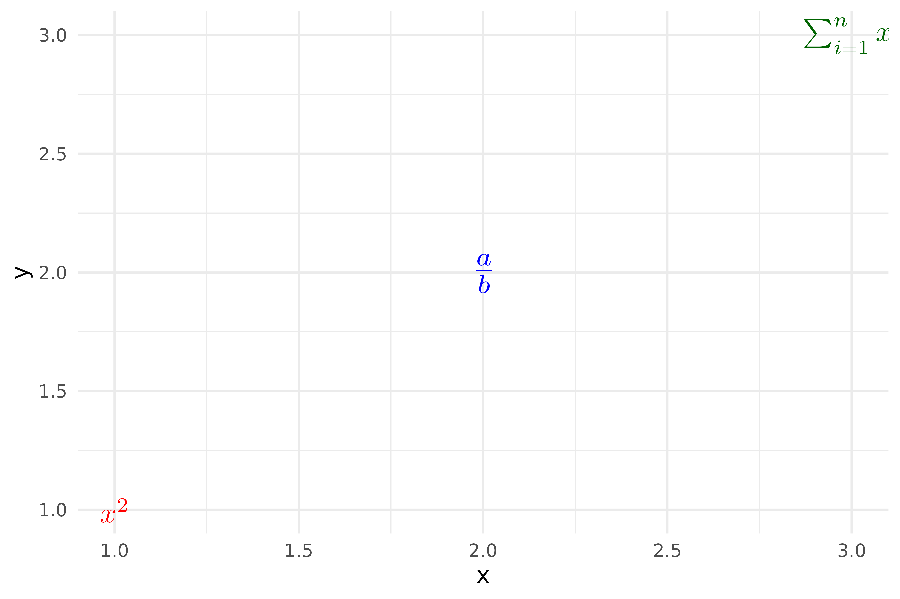
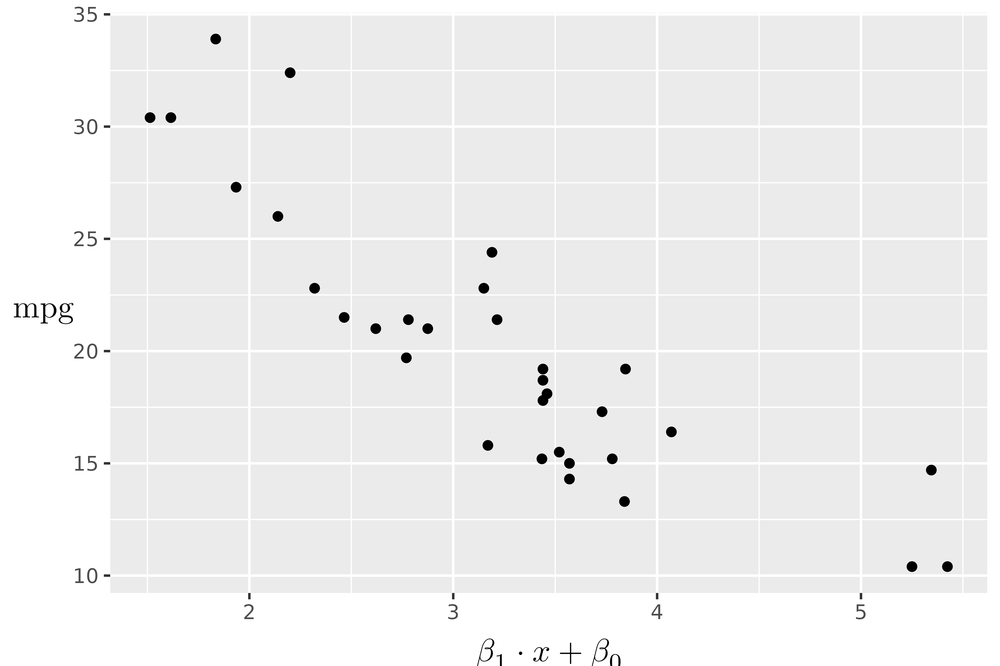
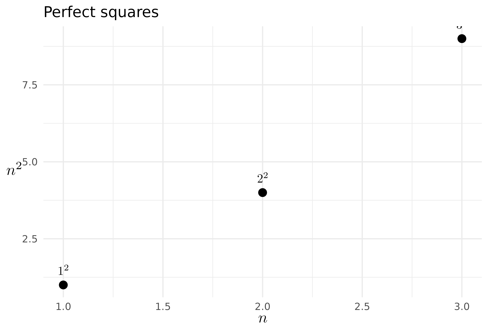

# Using LaTeX Math in ggplot2

gridmicrotex provides two ggplot2 extensions for rendering LaTeX math in
plots:

- **[`geom_latex()`](https://adayim.github.io/gridmicrotex/reference/geom_latex.md)**
  — a geom layer for placing LaTeX labels at data coordinates.
- **[`element_latex()`](https://adayim.github.io/gridmicrotex/reference/element_latex.md)**
  — a theme element for rendering axis titles, plot titles, and other
  text elements as LaTeX.

## Annotating plots with `geom_latex()`

[`geom_latex()`](https://adayim.github.io/gridmicrotex/reference/geom_latex.md)
works like
[`geom_text()`](https://ggplot2.tidyverse.org/reference/geom_text.html)
but interprets the `label` aesthetic as a LaTeX math string.

``` r
df <- data.frame(
  x = 1:3,
  y = 1:3,
  eq = c("x^2", "\\frac{a}{b}", "\\sum_{i=1}^n x_i")
)

ggplot(df, aes(x, y, label = eq)) +
  geom_latex() +
  theme_minimal()
```


### Controlling size and colour

Map the `size` (font size in points) and `colour` aesthetics as usual:

``` r
df$col <- c("red", "blue", "darkgreen")

ggplot(df, aes(x, y, label = eq, colour = col, size = c(14, 18, 14))) +
  geom_latex() +
  scale_colour_identity() +
  scale_size_identity() +
  theme_minimal()
```



### Adding equation annotations to a scatter plot

A common use case is annotating a regression fit with the model
equation.

``` r
fit <- lm(mpg ~ wt, data = mtcars)
b0 <- round(coef(fit)[1], 1)
b1 <- round(coef(fit)[2], 1)
r2 <- round(summary(fit)$r.squared, 3)

eq_label <- sprintf("\\hat{y} = %s %s x, \\quad R^2 = %s",
                     b0, b1, r2)

ggplot(mtcars, aes(wt, mpg)) +
  geom_point() +
  geom_smooth(method = "lm", se = FALSE) +
  geom_latex(
    data = data.frame(x = 4, y = 30, label = eq_label),
    aes(x, y, label = label),
    fontsize = 12
  ) +
  theme_minimal()
#> `geom_smooth()` using formula = 'y ~ x'
```


## LaTeX axis titles with `element_latex()`

[`element_latex()`](https://adayim.github.io/gridmicrotex/reference/element_latex.md)
replaces a text theme element so that its label is rendered as LaTeX
math.

``` r
ggplot(mtcars, aes(wt, mpg)) +
  geom_point() +
  labs(
    x = "$\\beta_1 \\cdot x + \\beta_0$",
    y = "$\\mathrm{mpg}$"
  ) +
  theme(
    axis.title.x = element_latex(fontsize = 14),
    axis.title.y = element_latex(fontsize = 14)
  )
```



Dollar-sign delimiters (`$...$`) are stripped automatically, so both
`"\\frac{a}{b}"` and `"$\\frac{a}{b}$"` produce the same output.

## Combining both extensions

You can use
[`geom_latex()`](https://adayim.github.io/gridmicrotex/reference/geom_latex.md)
and
[`element_latex()`](https://adayim.github.io/gridmicrotex/reference/element_latex.md)
together:

``` r
df <- data.frame(
  x = c(1, 2, 3),
  y = c(1, 4, 9),
  eq = c("1^2", "2^2", "3^2")
)

ggplot(df, aes(x, y, label = eq)) +
  geom_point(size = 3) +
  geom_latex(vjust = -1, fontsize = 14) +
  labs(
    x = "$n$",
    y = "$n^2$",
    title = "Perfect squares"
  ) +
  theme_minimal() +
  theme(
    axis.title.x = element_latex(fontsize = 14),
    axis.title.y = element_latex(fontsize = 14)
  )
```


