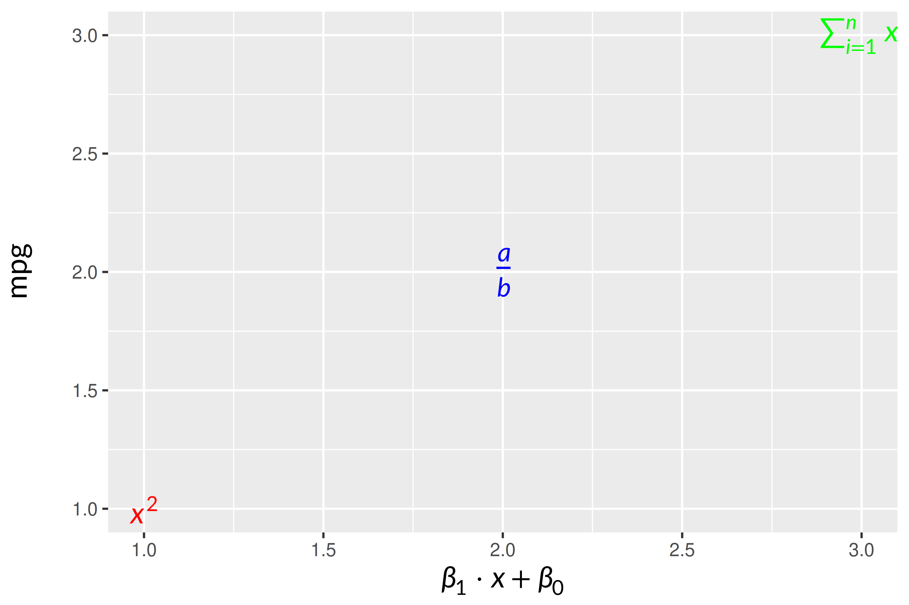
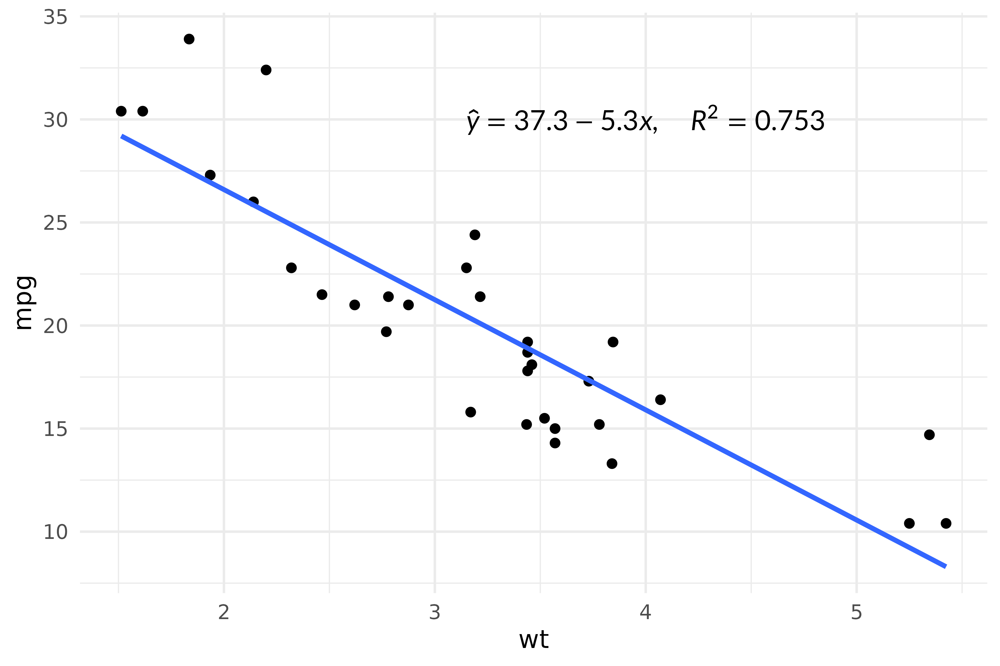
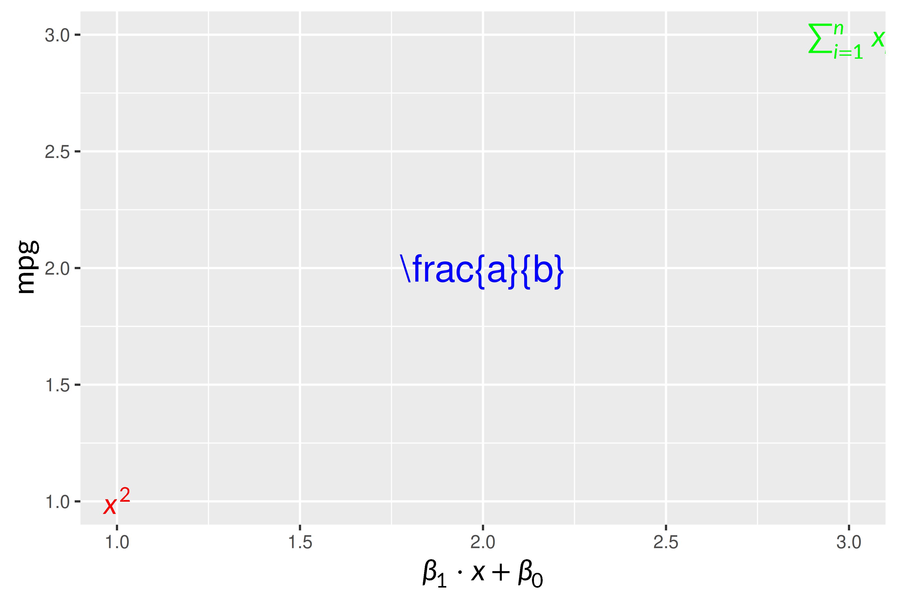
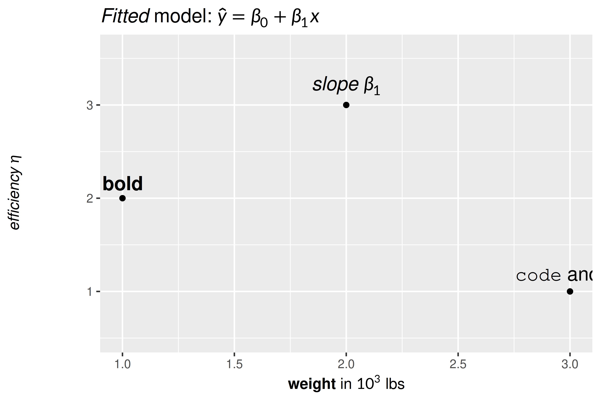
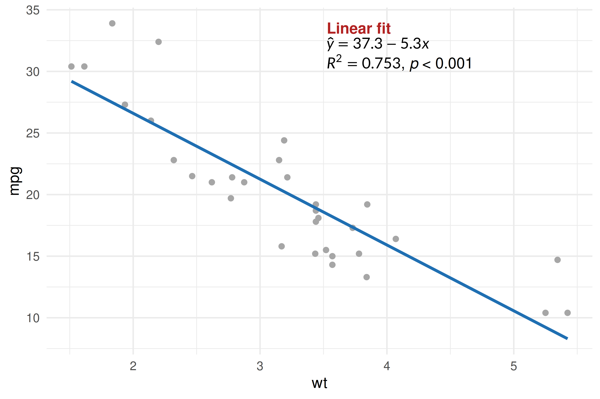
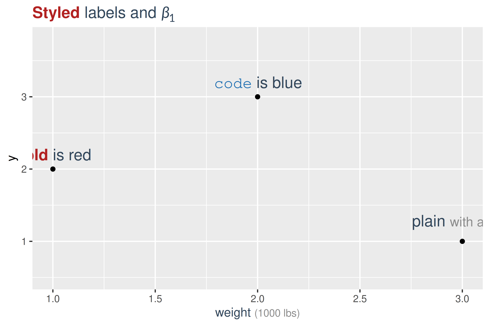
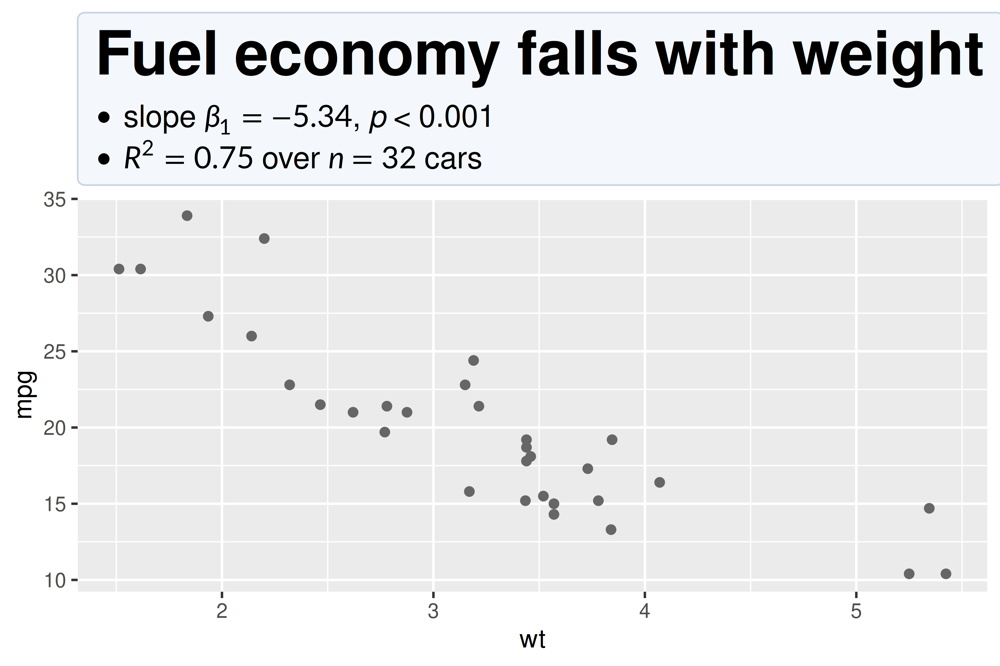

# Using LaTeX Math in ggplot2

## `geom_latex()` and `element_latex()`

[`geom_latex()`](https://adayim.github.io/gridmicrotex/reference/geom_latex.md)
works like
[`geom_text()`](https://ggplot2.tidyverse.org/reference/geom_text.html),
with LaTeX labels. The `size` aesthetic is the font size in points.
[`element_latex()`](https://adayim.github.io/gridmicrotex/reference/element_latex.md)
renders a theme element, such as an axis title, as LaTeX.

``` r

df <- data.frame(
  x = 1:3,
  y = 1:3,
  eq = c(r"($x^2$)", r"(\frac{a}{b})", r"($\sum_{i=1}^n x_i$)"),
  col = c("red", "blue", "green")
)

ggplot(df, aes(x, y,
               label = eq,
               colour = col,
               size = c(14, 18, 14))) +
  geom_latex() +
  scale_colour_identity() +
  scale_size_identity() +
  labs(
    x = r"($\beta_1 \cdot x + \beta_0$)",
    y = r"($\mathrm{mpg}$)"
  ) +
  theme(
    axis.title.x = element_latex(fontsize = 14),
    axis.title.y = element_latex(fontsize = 14)
  )
```



The `$` signs are optional here: `\frac{a}{b}` and `$\frac{a}{b}$` give
the same result.

### Annotations

`annotate("latex", ...)` adds a single label:

``` r

fit <- lm(mpg ~ wt, data = mtcars)
b0 <- round(coef(fit)[1], 1)
b1 <- round(coef(fit)[2], 1)
r2 <- round(summary(fit)$r.squared, 3)

eq_label <- sprintf(r"($\hat{y} = %s %s x, \quad R^2 = %s$)", b0, b1, r2)

ggplot(mtcars, aes(wt, mpg)) +
  geom_point() +
  geom_smooth(method = "lm", se = FALSE) +
  annotate("latex", x = 4, y = 30, label = eq_label, size = 12) +
  theme_minimal()
#> `geom_smooth()` using formula = 'y ~ x'
```



## Without new functions

With `latex_options(device_math = TRUE)`, ordinary
[`geom_text()`](https://ggplot2.tidyverse.org/reference/geom_text.html)
and [`labs()`](https://ggplot2.tidyverse.org/reference/labs.html) labels
are typeset too. Here is the first plot using only ggplot2 functions:

``` r

latex_options(device_math = TRUE)

ggplot(df, aes(x, y,
               label = eq,
               colour = col,
               size = c(14, 18, 14))) +
  geom_text(size.unit = "pt") +
  scale_colour_identity() +
  scale_size_identity() +
  labs(
    x = r"($\beta_1 \cdot x + \beta_0$)",
    y = r"($\mathrm{mpg}$)"
  ) +
  theme(axis.title = element_text(size = 14))
```



Here math needs its `$` signs, so the middle label stays literal.
`device_math` applies to the whole session and does not make room for
tall formulas;
[`geom_latex()`](https://adayim.github.io/gridmicrotex/reference/geom_latex.md)
and
[`element_latex()`](https://adayim.github.io/gridmicrotex/reference/element_latex.md)
do. See
[`vignette("base-graphics")`](https://adayim.github.io/gridmicrotex/articles/base-graphics.md).

## Markdown labels

[`geom_markdown()`](https://adayim.github.io/gridmicrotex/reference/geom_markdown.md)
and
[`element_markdown()`](https://adayim.github.io/gridmicrotex/reference/element_markdown.md)
take markdown with `$math$`, for labels that are more text than formula:

``` r

df <- data.frame(
  x   = 1:3,
  y   = c(2, 3, 1),
  lab = c("**bold**", r"(*slope* $\beta_1$)", "`code` and $x^2$")
)

ggplot(df, aes(x, y, label = lab)) +
  geom_point() +
  geom_markdown(fontsize = 14, vjust = -0.6) +
  ylim(0.5, 3.6) +
  labs(
    title = r"(*Fitted* model: $\hat{y} = \beta_0 + \beta_1 x$)",
    x     = "**weight** in $10^3$ lbs",
    y     = r"(*efficiency* $\eta$)"
  ) +
  theme(
    plot.title   = element_markdown(fontsize = 14),
    axis.title.x = element_markdown(),
    axis.title.y = element_markdown()
  )
```



`annotate("markdown", ...)` adds one label; `<br>` starts a new line:

``` r

fit <- lm(mpg ~ wt, data = mtcars)

note <- sprintf(
  r"(**Linear fit**<br>$\hat{y} = %s %s x$<br>$R^2 = %s$, *p* < 0.001)",
  round(coef(fit)[1], 1),
  round(coef(fit)[2], 1),
  round(summary(fit)$r.squared, 3)
)

ggplot(mtcars, aes(wt, mpg)) +
  geom_point(colour = "grey65") +
  geom_smooth(method = "lm", se = FALSE, colour = "#1F6FB2") +
  annotate("markdown", x = 4.1, y = 32, label = note, size = 11,
           style = "strong { color: #B22222 }") +
  theme_minimal()
#> `geom_smooth()` using formula = 'y ~ x'
```



### Styling

`style` takes CSS, as in
[`vignette("markdown")`](https://adayim.github.io/gridmicrotex/articles/markdown.md).
`<span class="...">` styles part of a label:

``` r

css <- "
  body   { color: #33475B }
  strong { color: #B22222 }
  code   { color: #1F6FB2 }
  .unit  { color: grey55; font-size: smaller }
"

df <- data.frame(
  x = 1:3, y = c(2, 3, 1),
  lab = c("**bold** is red", "`code` is blue",
          'plain <span class="unit">with a note</span>')
)

ggplot(df, aes(x, y, label = lab)) +
  geom_point() +
  geom_markdown(style = css, fontsize = 14, vjust = -0.8) +
  ylim(0.5, 3.8) +
  labs(title = r"(**Styled** labels and $\beta_1$)",
       x = 'weight <span class="unit">(1000 lbs)</span>') +
  theme(
    plot.title   = element_markdown(style = css, fontsize = 14),
    axis.title.x = element_markdown(style = css)
  )
```



Margins, padding and backgrounds apply only to block titles (below).
`latex_options(markdown_style = )` sets a default style for the session.

### Block titles

A title with a heading, a list or several paragraphs is laid out as a
small document, and the `body` rule styles its box:

``` r

ggplot(mtcars, aes(wt, mpg)) +
  geom_point(colour = "grey40") +
  labs(title = r"(## Fuel economy falls with weight

- slope $\beta_1 = -5.34$, *p* < 0.001
- $R^2 = 0.75$ over $n = 32$ cars)") +
  theme(plot.title = element_markdown(style = "
    body { background: #F4F7FB; padding: 10px;
           border: 1px solid #C7D6E5; border-radius: 4px }
  "))
```



- Text does not wrap unless you give `width`; `unit(1, "npc")` suits a
  title.
- Axis tick labels and rotated labels are never laid out as blocks.
