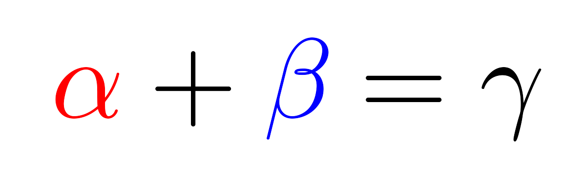
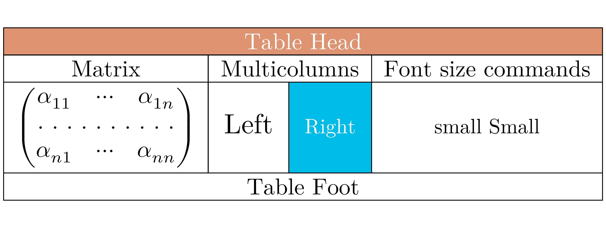
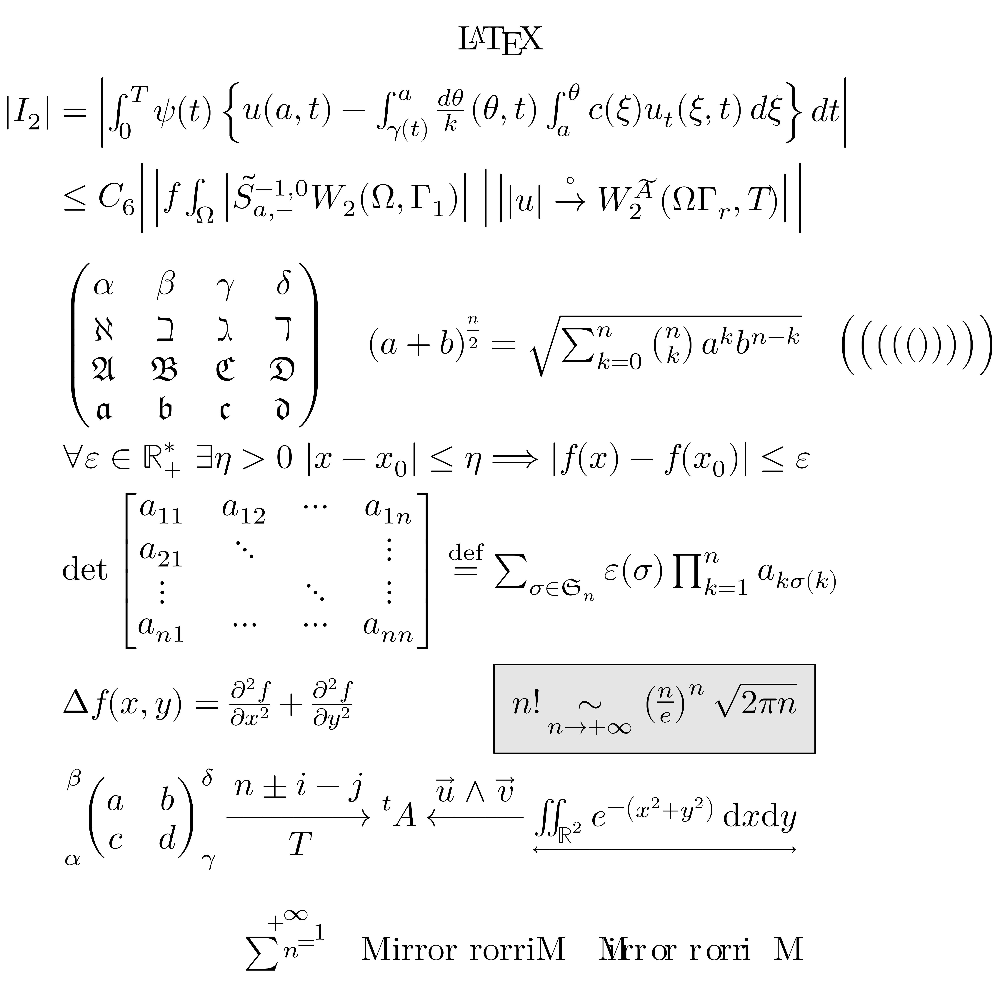

# Introduction to gridmicrotex

## What is gridmicrotex?

**gridmicrotex** renders LaTeX math equations as native R `grid`
graphics objects (grobs). It uses the
[MicroTeX](https://github.com/NanoMichael/MicroTeX) C++ library as its
layout engine — MicroTeX parses LaTeX, builds the TeX box model, and
computes exact glyph coordinates. The package intercepts this layout
data and maps it to native grid primitives (`pathGrob`, `segmentsGrob`,
`rectGrob`, `textGrob`), producing a `gTree` that works on any R
graphics device at any resolution.

**Key features:**

- No external LaTeX installation required — MicroTeX is fully embedded
- Resolution-independent vector output on all R devices (PNG, PDF, SVG,
  …)
- Full math support: fractions, roots, integrals, matrices, Greek
  letters, accents, delimiters, and more
- Multiple math fonts (Latin Modern Math, XITS Math, TeX Gyre DejaVu
  Math)
- Color support via `\textcolor{}`
- ggplot2 integration with
  [`geom_latex()`](https://adayim.github.io/gridmicrotex/reference/geom_latex.md)
  and
  [`element_latex()`](https://adayim.github.io/gridmicrotex/reference/element_latex.md)
- CJK and multilingual text in `\text{}` blocks

## Basic usage

The core function is
[`latex_grob()`](https://adayim.github.io/gridmicrotex/reference/latex_grob.md),
which returns a grid grob:

``` r
g <- latex_grob("\\frac{-b \\pm \\sqrt{b^2 - 4ac}}{2a}", fontsize = 24)
grid::grid.newpage()
grid::grid.draw(g)
```


For quick rendering, use
[`grid.latex()`](https://adayim.github.io/gridmicrotex/reference/grid.latex.md):

``` r
grid::grid.newpage()
grid.latex("\\sum_{i=1}^{n} x_i^2", fontsize = 28)
```


## Positioning and justification

Control placement with `x`, `y`, `hjust`, and `vjust`:

``` r
grid::grid.newpage()
grid.latex("E = mc^2", x = 0.2, y = 0.7, hjust = 0, fontsize = 24)
grid.latex("F = ma", x = 0.2, y = 0.3, hjust = 0, fontsize = 24)
```


## Colors

Set the formula color via `gp`, or use `\textcolor{}` within the LaTeX:

``` r
grid::grid.newpage()
grid.latex(
  "\\textcolor{red}{\\alpha} + \\textcolor{blue}{\\beta} = \\gamma",
  fontsize = 28
)
```



## Math fonts

The package bundles Latin Modern Math (default), XITS Math, and TeX Gyre
DejaVu Math. For most users, the easiest workflow is:

1.  List available math fonts with
    [`available_math_fonts()`](https://adayim.github.io/gridmicrotex/reference/available_math_fonts.md)
2.  Select one with
    [`set_math_font()`](https://adayim.github.io/gridmicrotex/reference/set_math_font.md)
3.  Render formulas normally (no OTF/CLM paths needed)

``` r
available_math_fonts()
#> [1] "LatinModernMath-Regular"   "TeXGyreDejaVuMath-Regular"
#> [3] "XITS Math"
```

``` r
set_math_font("xits")
grid::grid.newpage()
grid.latex("\\int_0^1 f(x)\\,dx", fontsize = 24)
```


``` r

# Switch back to Latin Modern Math
set_math_font("lm")
```

You can still override the font per call via `math_font`:

``` r
grid::grid.newpage()
grid::pushViewport(grid::viewport(layout = grid::grid.layout(2, 1)))
grid::pushViewport(grid::viewport(layout.pos.row = 1))
grid.latex("\\int_0^1 f(x)\\,dx", fontsize = 24)
grid::upViewport()
grid::pushViewport(grid::viewport(layout.pos.row = 2))
grid.latex("\\int_0^1 f(x)\\,dx", fontsize = 24, math_font = "xits")
grid::upViewport(2)
```


Use
[`available_math_fonts()`](https://adayim.github.io/gridmicrotex/reference/available_math_fonts.md)
to list loaded fonts and
[`check_fonts()`](https://adayim.github.io/gridmicrotex/reference/check_fonts.md)
for a diagnostic report.

### Advanced: loading custom fonts

Use
[`load_font()`](https://adayim.github.io/gridmicrotex/reference/load_font.md)
only when you need a custom font that is not already bundled/loaded. In
the current engine, custom loading still needs a matching CLM metrics
file (auto-discovered when possible):

``` r
load_font("path/to/MyFont.otf")
```

You can find and download other fonts with CLM
[here](https://github.com/NanoMichael/MicroTeX/tree/openmath/res)

### Render modes

gridmicrotex supports two rendering modes for math glyphs:

- **`"typeface"`** (default): Renders glyphs as native text using the
  math font’s typeface. This produces selectable, searchable, and
  accessible text in PDF and SVG output. Requires the math font (e.g.,
  Latin Modern Math) to be installed on the system, and a device that
  supports font embedding (e.g.,
  [`ragg::agg_png()`](https://ragg.r-lib.org/reference/agg_png.html),
  `svglite::svglite()`,
  [`grDevices::cairo_pdf()`](https://rdrr.io/r/grDevices/cairo.html)).
  On devices that do not support typeface rendering (e.g., the base
  [`pdf()`](https://rdrr.io/r/grDevices/pdf.html) device), the package
  automatically falls back to path mode with a warning.

- **`"path"`**: Renders each glyph as a filled vector path. This works
  on all R graphics devices and produces pixel-perfect output. However,
  text in PDF/SVG output is not selectable or searchable.

``` r
# Default typeface mode (selectable text in PDF/SVG)
grid.latex("E = mc^2", fontsize = 24)

# Explicit path mode (works everywhere, but text is not selectable)
grid.latex("E = mc^2", fontsize = 24, render_mode = "path")
```

> **Important: Do not use
> [`showtext::showtext_auto()`](https://rdrr.io/pkg/showtext/man/showtext_auto.html)
> with typeface mode.** The
> [showtext](https://CRAN.R-project.org/package=showtext) package
> globally intercepts all text rendering and converts it to vector
> paths. This silently defeats typeface mode, causing all math glyphs to
> appear as paths instead of native text — even on devices like
> `svglite` and `ragg` that fully support font embedding. If you need
> showtext for other parts of your plot, disable it before drawing LaTeX
> formulas:
>
> ``` r
> showtext::showtext_auto(FALSE)
> grid.latex("E = mc^2", fontsize = 24)  # typeface mode works correctly
> ```

## Querying dimensions

[`latex_dims()`](https://adayim.github.io/gridmicrotex/reference/latex_dims.md)
returns the bounding box of an expression:

``` r
dims <- latex_dims("\\frac{a}{b}", fontsize = 20)
dims
#> $width
#> [1] 8bigpts
#> 
#> $height
#> [1] 21bigpts
#> 
#> $depth
#> [1] 7bigpts
#> 
#> $baseline
#> [1] 0.6662558
```

This is useful for layout calculations and ensuring labels fit.

## Text rendering and CJK support

Non-math text inside `\text{}` is rendered as a standard `textGrob`.
Characters not in the math font (such as CJK) are rendered using the
font specified in `gp$fontfamily`:

``` r
grid::grid.newpage()
grid.latex("x^2 + \\text{你好}", fontsize = 24, gp = grid::gpar(fontfamily = "sans"))
```


## Supported LaTeX

gridmicrotex uses the MicroTeX engine, which is a **math formula
renderer**, not a full document typesetter. It covers the vast majority
of math notation you would use in plots and figures, but does not
attempt to replace a full LaTeX installation.

### Complicated examples

``` r
grid::grid.newpage()
grid.latex(paste0(
      "\\begin{array}{l}",
      "  \\forall\\varepsilon\\in\\mathbb{R}_+^*\\ \\exists\\eta>0",
      "\\ |x-x_0|\\leq\\eta\\Longrightarrow|f(x)-f(x_0)|\\leq\\varepsilon\\\\",
      "  \\det",
      "  \\begin{bmatrix}",
      "      a_{11}&a_{12}&\\cdots&a_{1n}\\\\",
      "      a_{21}&\\ddots&&\\vdots\\\\",
      "      \\vdots&&\\ddots&\\vdots\\\\",
      "      a_{n1}&\\cdots&\\cdots&a_{nn}",
      "  \\end{bmatrix}",
      "  \\overset{\\mathrm{def}}{=}\\sum_{\\sigma\\in\\mathfrak{S}_n}",
      "\\varepsilon(\\sigma)\\prod_{k=1}^n a_{k\\sigma(k)}\\\\",
      "  \\int_0^\\infty{x^{2n} e^{-a x^2}\\,dx} = \\frac{2n-1}{2a}",
      " \\int_0^\\infty{x^{2(n-1)} e^{-a x^2}\\,dx}",
      " = \\frac{(2n-1)!!}{2^{n+1}} \\sqrt{\\frac{\\pi}{a^{2n+1}}}\\\\",
      "\\end{array}"
), fontsize = 16)
```


``` r
grid::grid.newpage()

grid.latex(
  "
  \\newcolumntype{s}{>{\\color{#1234B6}}c}
\\begin{array}{|c|c|c|s|}
  \\hline
  \\rowcolor{Tan}\\multicolumn{4}{|c|}{\\textcolor{white}{\\bold{\\text{Table Head}}}}\\\\
  \\hline
  \\text{Matrix}&\\multicolumn{2}{|c|}{\\text{Multicolumns}}&\\text{Font size commands}\\\\
  \\hline
  \\begin{pmatrix}
      \\alpha_{11}&\\cdots&\\alpha_{1n}\\\\
      \\hdotsfor{3}\\\\
      \\alpha_{n1}&\\cdots&\\alpha_{nn}
  \\end{pmatrix}
  &\\large \\text{Left}&\\cellcolor{#00bde5}\\small \\textcolor{white}{\\text{\\bold{Right}}}
  &\\small \\text{small Small}\\\\
  \\hline
  \\multicolumn{4}{|c|}{\\text{Table Foot}}\\\\
  \\hline
\\end{array}
  ",
  fontsize = 22
)
```



``` r
grid::grid.newpage()
grid.latex(
  "\\definecolor{gris}{gray}{0.9}
\\definecolor{noir}{rgb}{0,0,0}
\\definecolor{bleu}{rgb}{0,0,1}
\\fatalIfCmdConflict{false}
\\newcommand{\\pa}{\\left|}
\\begin{array}{c}
  \\LaTeX\\\\
  \\begin{split}
      |I_2| &= \\pa\\int_0^T\\psi(t)\\left\\{ u(a,t)-\\int_{\\gamma(t)}^a \\frac{d\\theta}{k} (\\theta,t) \\int_a^\\theta c(\\xi)
          u_t (\\xi,t)\\,d\\xi\\right\\}dt\\right|\\\\
      &\\le C_6 \\Bigg|\\pa f \\int_\\Omega \\pa\\widetilde{S}^{-1,0}_{a,-}
          W_2(\\Omega, \\Gamma_1)\\right|\\ \\right|\\left| |u|\\overset{\\circ}{\\to} W_2^{\\widetilde{A}}(\\Omega\\Gamma_r,T)\\right|\\Bigg|\\\\
      &\\\\
      &\\begin{pmatrix}
          \\alpha&\\beta&\\gamma&\\delta\\\\
          \\aleph&\\beth&\\gimel&\\daleth\\\\
          \\mathfrak{A}&\\mathfrak{B}&\\mathfrak{C}&\\mathfrak{D}\\\\
          \\boldsymbol{\\mathfrak{a}}&\\boldsymbol{\\mathfrak{b}}&\\boldsymbol{\\mathfrak{c}}&\\boldsymbol{\\mathfrak{d}}
      \\end{pmatrix}
      \\quad{(a+b)}^{\\frac{n}{2}}=\\sqrt{\\sum_{k=0}^n\\tbinom{n}{k}a^kb^{n-k}}\\quad
          \\Biggl(\\biggl(\\Bigl(\\bigl(()\\bigr)\\Bigr)\\biggr)\\Biggr)\\\\
      &\\forall\\varepsilon\\in\\mathbb{R}_+^*\\ \\exists\\eta>0\\ |x-x_0|\\leq\\eta\\Longrightarrow|f(x)-f(x_0)|\\leq\\varepsilon\\\\
      &\\det
      \\begin{bmatrix}
          a_{11}&a_{12}&\\cdots&a_{1n}\\\\
          a_{21}&\\ddots&&\\vdots\\\\
          \\vdots&&\\ddots&\\vdots\\\\
          a_{n1}&\\cdots&\\cdots&a_{nn}
      \\end{bmatrix}
      \\overset{\\mathrm{def}}{=}\\sum_{\\sigma\\in\\mathfrak{S}_n}\\varepsilon(\\sigma)\\prod_{k=1}^n a_{k\\sigma(k)}\\\\
      &\\Delta f(x,y)=\\frac{\\partial^2f}{\\partial x^2}+\\frac{\\partial^2f}{\\partial y^2}\\qquad\\qquad \\fcolorbox{noir}{gris}
          {n!\\underset{n\\rightarrow+\\infty}{\\sim} {\\left(\\frac{n}{e}\\right)}^n\\sqrt{2\\pi n}}\\\\
      &\\sideset{_\\alpha^\\beta}{_\\gamma^\\delta}{
      \\begin{pmatrix}
          a&b\\\\
          c&d
      \\end{pmatrix}}
      \\xrightarrow[T]{n\\pm i-j}\\sideset{^t}{}A\\xleftarrow{\\overrightarrow{u}\\wedge\\overrightarrow{v}}
          \\underleftrightarrow{\\iint_{\\mathds{R}^2}e^{-\\left(x^2+y^2\\right)}\\,\\mathrm{d}x\\mathrm{d}y}
  \\end{split}\\\\
  \\rotatebox{30}{\\sum_{n=1}^{+\\infty}}\\quad\\mbox{Mirror rorriM}\\reflectbox{\\mbox{Mirror rorriM}}
\\end{array}",
  fontsize = 22
)
```



### What is not supported

MicroTeX is a **math formula renderer**, not a full LaTeX engine. The
following are outside its scope:

- **Document structure**: `\section`, `\begin{document}`, page layout,
  headers/footers, `\tableofcontents`
- **Package loading**: `\usepackage{}` — all supported commands are
  built in
- **Paragraph text**: line breaking, hyphenation, justified paragraphs
- **TikZ / PGF** drawing commands
- **Images**: `\includegraphics`
- **Cross-references**: `\label`, `\ref`, `\cite`, bibliographies
- **Theorem environments**: `\begin{theorem}`, `\begin{proof}`
- **Lists**: `itemize`, `enumerate`, `description`
- **Some amsmath commands**: `\substack`, `\tag`, equation numbering

For most statistical graphics use cases — axis labels, annotations,
legends, and in-plot formulas — the supported feature set is more than
sufficient.

## Comparison with alternatives

| Approach         | LaTeX required? | Device independent? | Vector? | Math coverage |
|:-----------------|:---------------:|:-------------------:|:-------:|:-------------:|
| `tikzDevice`     |       Yes       |         No          |   Yes   |     Full      |
| `xdvir`          |       Yes       |         No          |   Yes   |     Full      |
| `latexpdf`       |       Yes       |         No          |   Yes   | Full (tables) |
| `latex2exp`      |       No        |         Yes         |   Yes   |    Limited    |
| `plotmath`       |       No        |         Yes         |   Yes   |    Limited    |
| **gridmicrotex** |     **No**      |       **Yes**       | **Yes** |   **Broad**   |

## Graphics backend

The default graphics device on Windows (`windows()`) and macOS
([`quartz()`](https://rdrr.io/r/grDevices/quartz.html)) may not find the
bundled math fonts, producing warnings like:

    font family not found in Windows font database

To avoid this, switch to a modern graphics backend that uses
[systemfonts](https://CRAN.R-project.org/package=systemfonts) for font
resolution:

``` r
# For knitr / R Markdown --- add to your setup chunk:
knitr::opts_chunk$set(dev = "ragg_png")

# For interactive use:
options(device = function(...) ragg::agg_png(tempfile(fileext = ".png"), ...))
```

Recommended backends:

| Backend                                                            | Format | Package                                               |
|:-------------------------------------------------------------------|:-------|:------------------------------------------------------|
| [`ragg::agg_png()`](https://ragg.r-lib.org/reference/agg_png.html) | PNG    | [ragg](https://CRAN.R-project.org/package=ragg)       |
| `svglite::svglite()`                                               | SVG    | [svglite](https://CRAN.R-project.org/package=svglite) |
| [`grDevices::cairo_pdf()`](https://rdrr.io/r/grDevices/cairo.html) | PDF    | Base R (Cairo build)                                  |

Alternatively, use `render_mode = "path"` to bypass font lookup entirely
— glyphs are drawn as vector paths, which works on all devices but
produces non-selectable text in PDF/SVG.
