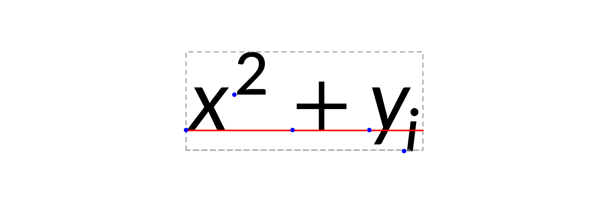

# Introduction to gridmicrotex

## What is gridmicrotex?

**gridmicrotex** renders LaTeX math equations as native R `grid`
graphics objects (grobs). It uses the
[MicroTeX](https://github.com/NanoMichael/MicroTeX) C++ library as its
layout engine — MicroTeX parses LaTeX, builds the TeX box model, and
computes exact glyph coordinates. The package intercepts this layout
data and maps it to native grid primitives (`pathGrob`, `segmentsGrob`,
`rectGrob`, `textGrob`), producing a `gTree` that works on any R
graphics device at any resolution.

**Key features:**

- No external LaTeX installation required — MicroTeX is fully embedded
- Resolution-independent vector output on all R devices (PNG, PDF, SVG,
  …)
- Full math support: fractions, roots, integrals, matrices, Greek
  letters, accents, delimiters, and more
- Two bundled math fonts: Lete Sans Math (sans-serif, default) and STIX
  Two Math (serif); additional fonts via
  [`load_font()`](https://adayim.github.io/gridmicrotex/reference/load_font.md)
- Color support via `\textcolor{}`
- ggplot2 integration with
  [`geom_latex()`](https://adayim.github.io/gridmicrotex/reference/geom_latex.md)
  and
  [`element_latex()`](https://adayim.github.io/gridmicrotex/reference/element_latex.md)
- CJK and multilingual text in `\text{}` blocks

## Basic usage

The core function is
[`latex_grob()`](https://adayim.github.io/gridmicrotex/reference/latex_grob.md),
which returns a grid grob:

``` r

g <- latex_grob("\\frac{-b \\pm \\sqrt{b^2 - 4ac}}{2a}", gp = grid::gpar(fontsize = 24))
grid::grid.newpage()
grid::grid.draw(g)
```


For quick rendering, use
[`grid.latex()`](https://adayim.github.io/gridmicrotex/reference/latex_grob.md):

``` r

grid::grid.newpage()
grid.latex("\\sum_{i=1}^{n} x_i^2", gp = grid::gpar(fontsize = 28))
```


## Positioning and justification

Control placement with `x`, `y`, `hjust`, and `vjust`:

``` r

grid::grid.newpage()
grid.latex("Famous $E = mc^2$", x = 0.2, y = 0.7, hjust = 0, gp = grid::gpar(fontsize = 24))
grid.latex("F = ma", x = 0.2, y = 0.3, hjust = 0, gp = grid::gpar(fontsize = 24), input_mode = "math")
```


By default, the input is treated as LaTeX math mode, which treats string
as text by default and use `$...$` or `\\(...\\)` delimiters to render
math. The `"Famous"` in the first equation above treated as text. The
`mixed` mode converts the input to math mode to reduce the user burden
for typing `\\text{}` and the conversion might not be perfect, but it
should handle most common cases without user intervention. Use
`input_mode = "math"` to treat the whole string as math mode (the second
example) or if you find a problem with the conversion and render text
with `\\text{}`. You can change this with global
`latex_options(input_mode = "math")` for heavy math or users who wants
to the advantages LaTex macros, etc. The vignette from next example will
set the input mode to `math` globally and render the whole string as
math mode.

## Colors

You can use `r"()"` raw strings to write LaTeX with regular newlines and
quotes without escaping. Set the formula color via `gp`, or use
`\textcolor{}` within the LaTeX:

``` r

latex_options(input_mode = "math") # Set math mode globally
grid::grid.newpage()
grid.latex(
  r"(\textcolor{red}{\alpha} + \textcolor{blue}{\beta} = \gamma)",
  gp = grid::gpar(fontsize = 28)
)
```


## Math fonts

The package ships with two math fonts, both loaded automatically:

| Alias              | Font           | License               |
|--------------------|----------------|-----------------------|
| `"lete"` (default) | Lete Sans Math | SIL Open Font License |
| `"stix"`           | STIX Two Math  | SIL Open Font License |

``` r

available_math_fonts()
#> [1] "DejaVu Sans"    "Lete Sans Math" "STIX Two Math"
```

``` r

latex_options(math_font = "stix")
grid::grid.newpage()
grid.latex(r"(\int_0^1 f(x)\,dx)", gp = grid::gpar(fontsize = 24))
```


``` r


# Switch back to the default (Lete Sans Math)
latex_options(math_font = "lete")
```

You can also override the font per call via `math_font`:

``` r

grid::grid.newpage()
grid::pushViewport(grid::viewport(layout = grid::grid.layout(2, 1)))
grid::pushViewport(grid::viewport(layout.pos.row = 1))
grid.latex(r"(\int_0^1 f(x)\,dx)", gp = grid::gpar(fontsize = 24))
grid::upViewport()
grid::pushViewport(grid::viewport(layout.pos.row = 2))
grid.latex(r"(\int_0^1 f(x)\,dx)", gp = grid::gpar(fontsize = 24), math_font = "stix")
grid::upViewport(2)
```


Use
[`available_math_fonts()`](https://adayim.github.io/gridmicrotex/reference/available_math_fonts.md)
to list loaded fonts and
[`check_fonts()`](https://adayim.github.io/gridmicrotex/reference/check_fonts.md)
for a diagnostic report.

### Advanced: loading custom fonts

Use
[`load_font()`](https://adayim.github.io/gridmicrotex/reference/load_font.md)
to add any additional OpenType math font. The OpenType MATH table is
parsed directly in C++ — no companion metrics file or external toolchain
is required:

``` r

load_font("path/to/MyFont.otf")
```

### Render modes

gridmicrotex supports two rendering modes for math glyphs:

- **`"typeface"`** (default): Renders glyphs as native text using the
  math font’s typeface. This produces selectable, searchable, and
  accessible text in PDF and SVG output. Bundled math fonts (Lete Sans
  Math, STIX Two Math) and any registered via
  [`load_font()`](https://adayim.github.io/gridmicrotex/reference/load_font.md)
  are read directly from their OTF files — no system-wide font install
  is required. Requires a device that supports the R 4.3 glyph engine
  (e.g.,
  [`ragg::agg_png()`](https://ragg.r-lib.org/reference/agg_png.html),
  `svglite::svglite()`,
  [`grDevices::cairo_pdf()`](https://rdrr.io/r/grDevices/cairo.html)).
  On devices that do not (e.g., the base
  [`pdf()`](https://rdrr.io/r/grDevices/pdf.html) device), the package
  automatically falls back to path mode with a warning.

- **`"path"`**: Renders each glyph as a filled vector path. This works
  on all R graphics devices and produces pixel-perfect output. However,
  text in PDF/SVG output is not selectable or searchable.

``` r

# Default typeface mode (selectable text in PDF/SVG)
grid.latex("E = mc^2", gp = grid::gpar(fontsize = 24))

# Explicit path mode (works everywhere, but text is not selectable)
grid.latex("E = mc^2", gp = grid::gpar(fontsize = 24), render_mode = "path")
```

> **Important: Do not use `showtext::showtext_auto()` with typeface
> mode.** The [showtext](https://CRAN.R-project.org/package=showtext)
> package globally intercepts all text rendering and converts it to
> vector paths. This silently defeats typeface mode, causing all math
> glyphs to appear as paths instead of native text — even on devices
> like `svglite` and `ragg` that fully support font embedding. If you
> need showtext for other parts of your plot, disable it before drawing
> LaTeX formulas:
>
> ``` r
>
> showtext::showtext_auto(FALSE)
> grid.latex("E = mc^2", gp = grid::gpar(fontsize = 24))  # typeface mode works correctly
> ```

## Querying dimensions

[`latex_dims()`](https://adayim.github.io/gridmicrotex/reference/latex_dims.md)
returns the bounding box of an expression:

``` r

dims <- latex_dims("\\frac{a}{b}", gp = grid::gpar(fontsize = 20))
dims
#> $width
#> [1] 7bigpts
#> 
#> $height
#> [1] 25bigpts
#> 
#> $depth
#> [1] 9bigpts
#> 
#> $baseline
#> [1] 9.36317294836044bigpts
#> 
#> $is_split
#> [1] FALSE
```

This is useful for layout calculations and ensuring labels fit.

## Text rendering and CJK support

Text inside `\text{}` and `\mbox{}` is rendered using R’s standard
text-rendering system. This means `gp$fontfamily` controls the font for
**all** text content — Latin letters, CJK characters, Cyrillic, and any
other script your R graphics device supports:

``` r

grid::grid.newpage()
grid.latex("x^2 + \\text{你好}", gp = grid::gpar(fontsize = 24, fontfamily = "sans"))
```


Any font available to R works: base families like `"sans"`, `"serif"`,
`"mono"`, or fonts registered via **showtext** / **systemfonts**.

### Font pairing

The bundled math fonts have different styles. For a consistent look,
pair them with a matching `fontfamily`:

| Math font                          | Style      | Suggested `fontfamily` |
|------------------------------------|------------|------------------------|
| Lete Sans Math (`"lete"`, default) | Sans-serif | `"sans"`               |
| STIX Two Math (`"stix"`)           | Serif      | `"serif"`              |

``` r

grid::grid.newpage()
grid.latex(
  "\\text{Theorem: } \\forall x \\in \\mathbb{R},\\; x^2 \\geq 0",
  math_font = "stix",
  gp = grid::gpar(fontfamily = "serif", fontsize = 12)
)
```


## Supported LaTeX

gridmicrotex uses the MicroTeX engine, which is a **math formula
renderer**, not a full document typesetter. It covers the vast majority
of math notation you would use in plots and figures, but does not
attempt to replace a full LaTeX installation.

### Complicated examples

``` r

grid::grid.newpage()
grid.latex(paste0(
      "\\begin{array}{l}",
      "  \\forall\\varepsilon\\in\\mathbb{R}_+^*\\ \\exists\\eta>0",
      "\\ |x-x_0|\\leq\\eta\\Longrightarrow|f(x)-f(x_0)|\\leq\\varepsilon\\\\",
      "  \\det",
      "  \\begin{bmatrix}",
      "      a_{11}&a_{12}&\\cdots&a_{1n}\\\\",
      "      a_{21}&\\ddots&&\\vdots\\\\",
      "      \\vdots&&\\ddots&\\vdots\\\\",
      "      a_{n1}&\\cdots&\\cdots&a_{nn}",
      "  \\end{bmatrix}",
      "  \\overset{\\mathrm{def}}{=}\\sum_{\\sigma\\in\\mathfrak{S}_n}",
      "\\varepsilon(\\sigma)\\prod_{k=1}^n a_{k\\sigma(k)}\\\\",
      "  \\int_0^\\infty{x^{2n} e^{-a x^2}\\,dx} = \\frac{2n-1}{2a}",
      " \\int_0^\\infty{x^{2(n-1)} e^{-a x^2}\\,dx}",
      " = \\frac{(2n-1)!!}{2^{n+1}} \\sqrt{\\frac{\\pi}{a^{2n+1}}}\\\\",
      "\\end{array}"
), gp = grid::gpar(fontsize = 16))
```


``` r

grid::grid.newpage()

grid.latex(
  "
  \\newcolumntype{s}{>{\\color{#1234B6}}c}
\\begin{array}{|c|c|c|s|}
  \\hline
  \\rowcolor{Tan}\\multicolumn{4}{|c|}{\\textcolor{white}{\\bold{\\text{Table Head}}}}\\\\
  \\hline
  \\text{Matrix}&\\multicolumn{2}{|c|}{\\text{Multicolumns}}&\\text{Font size commands}\\\\
  \\hline
  \\begin{pmatrix}
      \\alpha_{11}&\\cdots&\\alpha_{1n}\\\\
      \\hdotsfor{3}\\\\
      \\alpha_{n1}&\\cdots&\\alpha_{nn}
  \\end{pmatrix}
  &\\large \\text{Left}&\\cellcolor{#00bde5}\\small \\textcolor{white}{\\text{\\bold{Right}}}
  &\\small \\text{small Small}\\\\
  \\hline
  \\multicolumn{4}{|c|}{\\text{Table Foot}}\\\\
  \\hline
\\end{array}
  ",
  gp = grid::gpar(fontsize = 22)
)
```


``` r

grid::grid.newpage()
grid.latex(
  "\\definecolor{gris}{gray}{0.9}
\\definecolor{noir}{rgb}{0,0,0}
\\definecolor{bleu}{rgb}{0,0,1}
\\fatalIfCmdConflict{false}
\\newcommand{\\pa}{\\left|}
\\begin{array}{c}
  \\LaTeX\\\\
  \\begin{split}
      |I_2| &= \\pa\\int_0^T\\psi(t)\\left\\{ u(a,t)-\\int_{\\gamma(t)}^a \\frac{d\\theta}{k} (\\theta,t) \\int_a^\\theta c(\\xi)
          u_t (\\xi,t)\\,d\\xi\\right\\}dt\\right|\\\\
      &\\le C_6 \\Bigg|\\pa f \\int_\\Omega \\pa\\widetilde{S}^{-1,0}_{a,-}
          W_2(\\Omega, \\Gamma_1)\\right|\\ \\right|\\left| |u|\\overset{\\circ}{\\to} W_2^{\\widetilde{A}}(\\Omega\\Gamma_r,T)\\right|\\Bigg|\\\\
      &\\\\
      &\\begin{pmatrix}
          \\alpha&\\beta&\\gamma&\\delta\\\\
          \\aleph&\\beth&\\gimel&\\daleth\\\\
          \\mathfrak{A}&\\mathfrak{B}&\\mathfrak{C}&\\mathfrak{D}\\\\
          \\boldsymbol{\\mathfrak{a}}&\\boldsymbol{\\mathfrak{b}}&\\boldsymbol{\\mathfrak{c}}&\\boldsymbol{\\mathfrak{d}}
      \\end{pmatrix}
      \\quad{(a+b)}^{\\frac{n}{2}}=\\sqrt{\\sum_{k=0}^n\\tbinom{n}{k}a^kb^{n-k}}\\quad
          \\Biggl(\\biggl(\\Bigl(\\bigl(()\\bigr)\\Bigr)\\biggr)\\Biggr)\\\\
      &\\forall\\varepsilon\\in\\mathbb{R}_+^*\\ \\exists\\eta>0\\ |x-x_0|\\leq\\eta\\Longrightarrow|f(x)-f(x_0)|\\leq\\varepsilon\\\\
      &\\det
      \\begin{bmatrix}
          a_{11}&a_{12}&\\cdots&a_{1n}\\\\
          a_{21}&\\ddots&&\\vdots\\\\
          \\vdots&&\\ddots&\\vdots\\\\
          a_{n1}&\\cdots&\\cdots&a_{nn}
      \\end{bmatrix}
      \\overset{\\mathrm{def}}{=}\\sum_{\\sigma\\in\\mathfrak{S}_n}\\varepsilon(\\sigma)\\prod_{k=1}^n a_{k\\sigma(k)}\\\\
      &\\Delta f(x,y)=\\frac{\\partial^2f}{\\partial x^2}+\\frac{\\partial^2f}{\\partial y^2}\\qquad\\qquad \\fcolorbox{noir}{gris}
          {n!\\underset{n\\rightarrow+\\infty}{\\sim} {\\left(\\frac{n}{e}\\right)}^n\\sqrt{2\\pi n}}\\\\
      &\\sideset{_\\alpha^\\beta}{_\\gamma^\\delta}{
      \\begin{pmatrix}
          a&b\\\\
          c&d
      \\end{pmatrix}}
      \\xrightarrow[T]{n\\pm i-j}\\sideset{^t}{}A\\xleftarrow{\\overrightarrow{u}\\wedge\\overrightarrow{v}}
          \\underleftrightarrow{\\iint_{\\mathds{R}^2}e^{-\\left(x^2+y^2\\right)}\\,\\mathrm{d}x\\mathrm{d}y}
  \\end{split}\\\\
  \\rotatebox{30}{\\sum_{n=1}^{+\\infty}}\\quad\\mbox{Mirror rorriM}\\reflectbox{\\mbox{Mirror rorriM}}
\\end{array}",
  gp = grid::gpar(fontsize = 22),
  render_mode = "path"
)
```


### What is not supported

MicroTeX is a **math formula renderer**, not a full LaTeX engine. The
following are outside its scope:

- **Document structure**: `\section`, `\begin{document}`, page layout,
  headers/footers, `\tableofcontents`
- **Package loading**: `\usepackage{}` — all supported commands are
  built in
- **Paragraph text**: line breaking, hyphenation, justified paragraphs
- **TikZ / PGF** drawing commands
- **Images**: `\includegraphics`
- **Cross-references**: `\label`, `\ref`, `\cite`, bibliographies
- **Theorem environments**: `\begin{theorem}`, `\begin{proof}`
- **Lists**: `itemize`, `enumerate`, `description`
- **Some amsmath commands**: `\substack`, `\tag`, equation numbering

For most statistical graphics use cases — axis labels, annotations,
legends, and in-plot formulas — the supported feature set is more than
sufficient.

## Project-wide defaults

[`latex_options()`](https://adayim.github.io/gridmicrotex/reference/latex_options.md)
sets defaults for `math_font` and `render_mode`, used by
[`latex_grob()`](https://adayim.github.io/gridmicrotex/reference/latex_grob.md),
[`grid.latex()`](https://adayim.github.io/gridmicrotex/reference/latex_grob.md),
[`latex_dims()`](https://adayim.github.io/gridmicrotex/reference/latex_dims.md),
and
[`latex_tree()`](https://adayim.github.io/gridmicrotex/reference/latex_tree.md)
whenever the corresponding argument is not supplied at the call site.
Size is controlled at the grob level via `gp$fontsize` / `gp$lineheight`
(see *Basic usage*).

``` r

latex_options(math_font = "stix", render_mode = "typeface")

# Later calls pick these up automatically
grid.latex("\\sum_{i=1}^{n} i^{2}", gp = grid::gpar(fontsize = 14))

# Query current settings
latex_options()

# Reset to built-in defaults
reset_latex_options()
```

Explicit arguments always win. Setting `math_font` via
[`latex_options()`](https://adayim.github.io/gridmicrotex/reference/latex_options.md)
also updates the MicroTeX engine default, so you don’t also need a
separate font-setup call.

## User-defined macros

[`define_macro()`](https://adayim.github.io/gridmicrotex/reference/define_macro.md)
registers zero-argument shorthands that are expanded by text
substitution before the expression reaches MicroTeX. Handy for recurring
notation:

``` r

define_macro("RR", "\\mathbb{R}")
define_macro("eps", "\\varepsilon")

grid::grid.newpage()
grid.latex("\\forall \\eps > 0, \\eps \\in \\RR", gp = grid::gpar(fontsize = 24))
```


``` r


clear_macros()
```

Macro names must be ASCII letters. Expansion iterates to a fixed point,
so macros can reference other macros. Use
[`list_macros()`](https://adayim.github.io/gridmicrotex/reference/define_macro.md)
to see currently registered ones, and
[`clear_macros()`](https://adayim.github.io/gridmicrotex/reference/define_macro.md)
(with no arguments) to drop them all.

## Layout caching

Parsed layouts are memoised by
`(tex, fontsize, math_font, render_mode, ...)`. Re-drawing the same
formula — for example, the same axis label across many plots — reuses
the cached layout:

``` r

latex_cache_info()       # size / max_size / hits / misses
latex_cache_limit(1024)  # raise or lower the LRU capacity
latex_cache_clear()      # wipe the cache (e.g. after re-loading fonts)
```

Set the limit to `0` to disable caching entirely.

## Introspecting a formula

[`latex_tree()`](https://adayim.github.io/gridmicrotex/reference/latex_tree.md)
returns the raw draw-record table plus bbox metadata, useful for
debugging alignment, counting glyphs, or building custom grobs on top of
the layout:

``` r

tr <- latex_tree("\\frac{a}{b}")
tr
#> <latex_tree>
#>   tex:         \frac{a}{b}
#>   render_mode: typeface
#>   bbox:        width=7.00  height=25.00  depth=9.00  baseline=0.63 (bigpts)
#>   records:     3
#>     glyph      2
#>     line       1
head(tr$records, 3)
#>    type         x      y glyph font_size   color    x2     y2 width height rx
#> 1 glyph 0.1890002  7.196  3628        14 #000000    NA     NA    NA     NA NA
#> 2  line 0.0000000 10.596    NA        NA #000000 7.392 10.596    NA     NA NA
#> 3 glyph 0.0000000 25.796  3629        14 #000000    NA     NA    NA     NA NA
#>   ry  lwd text font_style rotation path codepoint
#> 1 NA   NA <NA>         NA        0 NULL        NA
#> 2 NA 1.32 <NA>         NA        0 NULL        NA
#> 3 NA   NA <NA>         NA        0 NULL        NA
#>                                                             font_file
#> 1 /home/runner/work/_temp/Library/gridmicrotex/fonts/LeteSansMath.otf
#> 2                                                                <NA>
#> 3 /home/runner/work/_temp/Library/gridmicrotex/fonts/LeteSansMath.otf
```

## Debug overlay

Pass `debug = TRUE` to
[`latex_grob()`](https://adayim.github.io/gridmicrotex/reference/latex_grob.md)
/
[`grid.latex()`](https://adayim.github.io/gridmicrotex/reference/latex_grob.md)
to overlay diagnostics on the rendered formula — the full bounding box
(dashed gray), the baseline (solid red), and a dot at each draw record’s
origin. Useful for checking vertical alignment between a formula and
surrounding grobs:

``` r

grid::grid.newpage()
grid.latex("x^{2} + y_{i}", gp = grid::gpar(fontsize = 30), debug = TRUE)
```



## Comparison with alternatives

| Approach         | LaTeX required? | Device independent? | Vector? | Math coverage |
|:-----------------|:---------------:|:-------------------:|:-------:|:-------------:|
| `tikzDevice`     |       Yes       |         No          |   Yes   |     Full      |
| `xdvir`          |       Yes       |         No          |   Yes   |     Full      |
| `latexpdf`       |       Yes       |         No          |   Yes   | Full (tables) |
| `latex2exp`      |       No        |         Yes         |   Yes   |    Limited    |
| `plotmath`       |       No        |         Yes         |   Yes   |    Limited    |
| **gridmicrotex** |     **No**      |       **Yes**       | **Yes** |   **Broad**   |

## Graphics backend

The default graphics device on Windows (`windows()`) and macOS
([`quartz()`](https://rdrr.io/r/grDevices/quartz.html)) may not find the
bundled math fonts, producing warnings like:

    font family not found in Windows font database

To avoid this, switch to a modern graphics backend that uses
[systemfonts](https://CRAN.R-project.org/package=systemfonts) for font
resolution:

``` r

# For knitr / R Markdown --- add to your setup chunk:
knitr::opts_chunk$set(dev = "ragg_png")

# For interactive use:
options(device = function(...) ragg::agg_png(tempfile(fileext = ".png"), ...))
```

Recommended backends:

| Backend | Format | Package |
|:---|:---|:---|
| [`ragg::agg_png()`](https://ragg.r-lib.org/reference/agg_png.html) | PNG | [ragg](https://CRAN.R-project.org/package=ragg) |
| `svglite::svglite()` | SVG | [svglite](https://CRAN.R-project.org/package=svglite) |
| [`grDevices::cairo_pdf()`](https://rdrr.io/r/grDevices/cairo.html) | PDF | Base R (Cairo build) |

Alternatively, use `render_mode = "path"` to bypass font lookup entirely
— glyphs are drawn as vector paths, which works on all devices but
produces non-selectable text in PDF/SVG.
