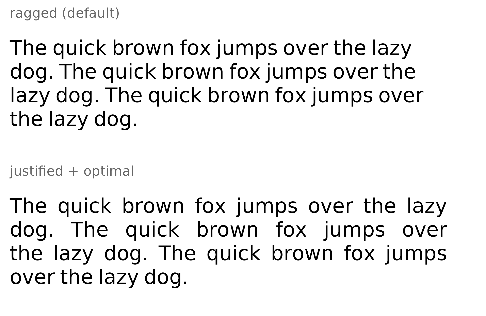
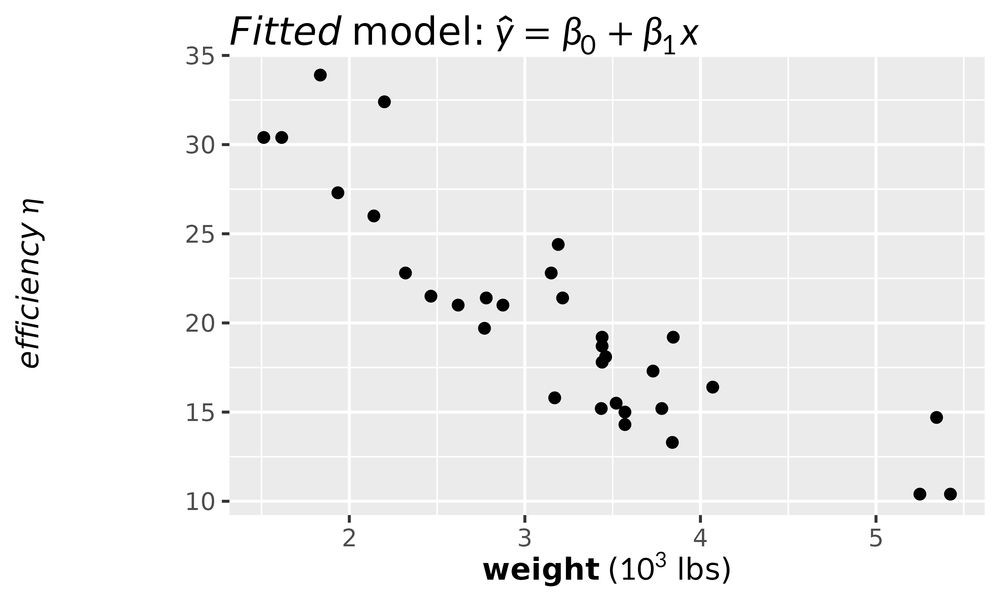

# Rendering Markdown with Math

Plot labels are rarely pure math. A title might be a bold phrase with a
symbol in it; a caption might be a short paragraph that happens to
contain an equation. `gridmicrotex` renders
[CommonMark](https://commonmark.org) markdown *and* LaTeX math together,
in one grob, with no external LaTeX installation.

It does this by translating the markdown to LaTeX and handing that to
MicroTeX — the same engine
[`latex_grob()`](https://adayim.github.io/gridmicrotex/reference/latex_grob.md)
uses. The `$...$` math in your markdown is passed straight through
untouched, so anything MicroTeX can typeset works inside a markdown
label.

There are two entry points:

- **[`markdown_grob()`](https://adayim.github.io/gridmicrotex/reference/markdown_grob.md)**
  (and
  [`grid.markdown()`](https://adayim.github.io/gridmicrotex/reference/markdown_grob.md))
  for a single flowing run of text — the right choice for a title or an
  axis label.
- **[`markdown_box_grob()`](https://adayim.github.io/gridmicrotex/reference/markdown_box_grob.md)**
  for a whole block document — headings, lists, block quotes, code,
  tables — inside an optional padded, filled box.

## Inline markdown

[`markdown_grob()`](https://adayim.github.io/gridmicrotex/reference/markdown_grob.md)
handles the inline part of markdown: `**bold**`, `*italic*`,
`` `code` ``, `~~strikethrough~~`, and any `$math$`.

``` r

grid.newpage()
grid.markdown(
  "The **fitted** slope is $\\beta_1 = 0.42$ (*p* < 0.001).",
  x = 0.02, hjust = 0, gp = gpar(fontsize = 20)
)
```


Because the math is real MicroTeX, the full engine is available inside a
markdown string — fractions, sums, matrices, Greek, accents:

``` r

grid.newpage()
grid.markdown(
  paste(
    "The estimator $\\hat{\\beta} = (X^\\top X)^{-1} X^\\top y$",
    "has variance $\\sigma^2$."
  ),
  x = 0.02, hjust = 0, gp = gpar(fontsize = 18)
)
```


### Wrapping long labels

Set `max_width` (in big points) to wrap a long label over several lines.

``` r

grid.newpage()
grid.markdown(
  paste(
    "This is a **long caption** with some $x^2$ math that is wide enough",
    "to wrap across several lines when a maximum width is set."
  ),
  x = 0.02, y = 0.95, hjust = 0, vjust = 1,
  max_width = 4 * 72,          # 4 inches, in big points
  gp = gpar(fontsize = 14)
)
```


### Colour and inline HTML

Markdown has no syntax for colour, underline, super/subscript, highlight
or size — CommonMark and GFM simply do not define one. The conformant
way to ask for them is the inline HTML that CommonMark already includes,
so that is what `gridmicrotex` reads. Each tag does what HTML’s own
default rendering says it should:

| tag | effect |
|----|----|
| `<b>`, `<strong>` | bold |
| `<i>`, `<em>`, `<cite>`, `<dfn>`, `<var>` | italic |
| `<code>`, `<kbd>`, `<samp>`, `<tt>` | monospace |
| `<u>`, `<ins>` | underline |
| `<s>`, `<del>`, `<strike>` | strikethrough |
| `<sub>`, `<sup>` | sub / superscript |
| `<mark>` | yellow highlight |
| `<small>`, `<big>` | smaller / larger |
| `<q>` | wrapped in quotation marks |
| `<br>` | line break |
| `<span style="…">` | `color`, `text-decoration`, `font-size`, `font-family` |

In a `style` attribute: `color` takes any R colour name, the nine CSS
names R happens to lack (`crimson`, `teal`, `rebeccapurple` and
friends), `#rgb`, `#rrggbb` or
[`rgb()`](https://rdrr.io/r/grDevices/rgb.html) — but note that `green`,
`gray`, `grey`, `maroon` and `purple` keep their R values rather than
their (darker) CSS ones, so that they mean the same thing here as in
`gpar(col = ...)`; `text-decoration` takes `underline` or
`line-through`; `font-size` takes `pt`, `px`, `in`, `cm`, `mm`, `em`,
`rem`, `%`, `smaller` or `larger`; `font-family` takes the CSS generics
`monospace`, `sans-serif` and `serif`, or any font name, including via a
fallback list like `'Courier New', monospace`. Any other property is
ignored.

``` r

grid.newpage()
grid.markdown(
  paste0(
    '<span style="font-size:26pt;color:#2E5E8E">Big</span> and ',
    '<span style="font-family:serif">serif</span> and ',
    '<span style="font-family:monospace">mono</span>.'
  ),
  x = 0.02, hjust = 0, gp = gpar(fontsize = 16)
)
```


### Which fonts are available

A family name goes straight to `gp$fontfamily`, so **the device resolves
it**, exactly as for any other grid text:

| device | sees |
|----|----|
| `ragg`, `svglite` | any installed family, plus [`systemfonts::register_font()`](https://systemfonts.r-lib.org/reference/register_font.html) |
| cairo (`png(type = "cairo")`, [`cairo_pdf()`](https://rdrr.io/r/grDevices/cairo.html)) | installed families |
| `windows()`, [`quartz()`](https://rdrr.io/r/grDevices/quartz.html) | the OS font list |
| base [`pdf()`](https://rdrr.io/r/grDevices/pdf.html), [`postscript()`](https://rdrr.io/r/grDevices/postscript.html) | **only** what [`pdfFonts()`](https://rdrr.io/r/grDevices/postscriptFonts.html) declares — a named family will not resolve |

An unavailable font falls back silently. Register a file that is not
installed system-wide first —
[`load_math_font()`](https://adayim.github.io/gridmicrotex/reference/load_math_font.md)
is *not* the function for this, as it registers *math* fonts with
MicroTeX:

``` r

systemfonts::register_font(name = "MyFont", plain = "path/to/MyFont.otf")
grid.markdown('<span style="font-family:MyFont">x</span>')
```

A span’s own family wins over `gp$fontfamily`, except for the width of
the spaces *between* its words. Set both to the same family if that
shows.

``` r

grid.newpage()
grid.markdown(
  paste0(
    'The <span style="color:#B22222">**residual**</span> for ',
    "H<sub>0</sub> is <u>within</u> $2\\sigma$."
  ),
  x = 0.02, hjust = 0, gp = gpar(fontsize = 20)
)
```


Tags nest, and markdown and `$math$` keep working inside them, so
`<u>**bold underlined**</u>` and `**<u>the same thing</u>**` render
alike. Any other tag is dropped and its text kept — as a browser does
with `<a>` or a bare `<span>`, which have no rendering of their own.

Two `<br>` in a row leave a blank line, as in HTML:

``` r

grid.newpage()
grid.markdown(
  "**Model fit**<br><br>Deviance <mark>412.7</mark> on term<sub>1</sub>.",
  x = 0.02, y = 0.85, vjust = 1, hjust = 0, gp = gpar(fontsize = 18)
)
```


## Block documents

[`markdown_box_grob()`](https://adayim.github.io/gridmicrotex/reference/markdown_box_grob.md)
lays out a full markdown document. Each block — heading, paragraph,
list, quote, code, table — becomes its own grob, stacked top to bottom.
The `width` you give is the box width; prose wraps to fit it.

``` r

md <- "
# Model summary

The slope is $\\beta_1$ with *p* < 0.001, and this paragraph is long
enough that it wraps inside the column.

## Diagnostics

- residuals look **fine**
- $R^2 = 0.87$
- no influential points

> Assumptions were checked and hold.
"

grid.newpage()
grid.draw(markdown_box_grob(
  md,
  width   = unit(4.6, "in"),
  padding = unit(10, "pt"),
  box_gp  = gpar(fill = "grey97", col = "grey40"),
  gp      = gpar(fontsize = 13)
))
```


Set `box_gp = NULL` to draw no box, or give the `r` argument a value
such as `unit(6, "pt")` for rounded corners. `padding` and `margin`
accept a single unit or a length-4 unit giving top, right, bottom, left.

### Lists, tasks, and tables

Ordered and unordered lists, GFM task lists, and tables all render.
Markdown tables become real typeset tables, with column alignment taken
from the `|:---:|` markers — something a text renderer cannot do.

``` r

md <- "
### Checklist

- [x] fit the model
- [ ] write it up

Coefficients:

| term | estimate | *p* |
|:-----|---------:|:---:|
| intercept | 30.1 | *** |
| slope | -5.3 | *** |
"

grid.newpage()
grid.draw(markdown_box_grob(
  md,
  width   = unit(4.4, "in"),
  padding = unit(8, "pt"),
  gp      = gpar(fontsize = 13)
))
```


### Images

An image on its own line is drawn as a raster, scaled to the column
width. `png` and `jpeg` are optional — if neither is installed, or the
file is missing, the image degrades to its alt text.

``` r

# Make a small PNG to embed (any .png / .jpeg path works).
img <- tempfile(fileext = ".png")
ragg::agg_png(img, width = 300, height = 90, res = 100)
grid.rect(gp = gpar(fill = "steelblue", col = NA))
grid.text("a figure", gp = gpar(col = "white", fontsize = 18))
invisible(dev.off())

md <- sprintf("
A figure with a caption below it.


The caption explains the figure.
", img)

grid.newpage()
grid.draw(markdown_box_grob(
  md, width = unit(4, "in"), padding = unit(8, "pt"),
  gp = gpar(fontsize = 13)
))
```


## Styling

Everything above uses the built-in look. To change it, hand
[`markdown_box_grob()`](https://adayim.github.io/gridmicrotex/reference/markdown_box_grob.md)
a `style`. It is a small CSS cascade over the markdown tags, and it
takes CSS directly — as text, or as the path to a `.css` file:

``` r

doc <- "
# Results

The slope is $\\beta_1$ with *p* < 0.001.

> Worth a second look.
"

grid.newpage()
grid.draw(markdown_box_grob(
  doc,
  width = unit(4.5, "in"), padding = unit(10, "pt"),
  style = "
    h1         { color: steelblue; font-size: 1.8rem }
    blockquote { color: grey40; border-left: 3px solid steelblue }
  ",
  gp = gpar(fontsize = 13)
))
```


The same thing written in R, which validates property names and
autocompletes:

``` r

markdown_style(
  h1         = md_style(color = "steelblue", font_size = 1.8),
  blockquote = md_style(color = "grey40",
                        border_left = "3px solid steelblue")
)
```

Lengths take three forms: a bare number is `rem`, a multiple of the body
font size; a string is whatever CSS says (`"1.8rem"`, `"12pt"`,
`"150%"`); and a [`grid::unit()`](https://rdrr.io/r/grid/unit.html) is
absolute.

Tags are named as in HTML — `body`, `p`, `h1`–`h6`, `ul`, `ol`, `li`,
`blockquote`, `pre`, `code`, `table`, `hr`, `img`, `div`, `span`. The
properties are the ones MicroTeX and grid can honour — colour, the font
family, size, weight and slant, decorations, line height, margins, left
padding, alignment and the two borders.
[`?md_style`](https://adayim.github.io/gridmicrotex/reference/md_style.md)
has the full table, including which of them work on an inline `<span>`
as well as on a block. Anything outside it parses and is then ignored,
the way a browser ignores what it does not implement — so an existing
stylesheet can be pasted in and the parts that apply still work.

### Starting from a preset

`markdown_style("github")` is a GitHub-like look, shipped as a CSS file
you can read and copy:

``` r

markdown_style("github", h1 = md_style(color = "firebrick"))
file.show(system.file("css", "github.css", package = "gridmicrotex"))
```

Pass an existing style as the first argument to extend it, and use
`latex_options(markdown_style = ...)` to set one for a whole document.

### Styling one chunk

A style set says how *every* heading looks. To style one particular
chunk, wrap it in a `<div>` with a `class` or a `style`. **Leave blank
lines around the tags** — that is what makes CommonMark parse the
markdown between them rather than treating the whole block as raw HTML:

``` r

doc <- '
Ordinary text.

<div class="note">

**Note.** This chunk is indented and set apart.

</div>

Ordinary text again.
'

grid.newpage()
grid.draw(markdown_box_grob(
  doc,
  width = unit(4.5, "in"), padding = unit(10, "pt"),
  style = ".note { color: grey35; padding-left: 1.5rem }",
  gp = gpar(fontsize = 13)
))
```


Inheritable properties — colour and the `font-*` family — fall through
to everything inside the div, exactly as in CSS; margins, padding and
borders do not. `<span class="...">` works the same way for an inline
run.

## Line breaking and justification

Two optional refinements apply once text wraps (both need `max_width`,
and both are off by default so the output matches R’s usual ragged-right
text).

`justify = TRUE` stretches the interword spaces so every line but the
last fills the width exactly. `line_break = "optimal"` chooses the line
breaks by total fit rather than greedily, so the paragraph reads more
evenly. Note that `gridmicrotex` does not hyphenate, so a justified
*narrow* column can open wide word gaps.

``` r

prose <- paste(rep(
  "The quick brown fox jumps over the lazy dog.", 3), collapse = " ")

grid.newpage()
pushViewport(viewport(layout = grid.layout(2, 1)))

pushViewport(viewport(layout.pos.row = 1))
grid.text("ragged (default)", x = 0.02, y = 0.95, hjust = 0, vjust = 1,
          gp = gpar(fontsize = 8, col = "grey40"))
grid.markdown(prose, x = 0.02, y = 0.75, hjust = 0, vjust = 1,
              max_width = 3.6 * 72, gp = gpar(fontsize = 12))
popViewport()

pushViewport(viewport(layout.pos.row = 2))
grid.text("justified + optimal", x = 0.02, y = 0.95, hjust = 0, vjust = 1,
          gp = gpar(fontsize = 8, col = "grey40"))
grid.markdown(prose, x = 0.02, y = 0.75, hjust = 0, vjust = 1,
              max_width = 3.6 * 72, justify = TRUE, line_break = "optimal",
              gp = gpar(fontsize = 12))
popViewport()
popViewport()
```



## In ggplot2

Markdown works as a geom and as a theme element, mirroring
[`geom_latex()`](https://adayim.github.io/gridmicrotex/reference/geom_latex.md)
and
[`element_latex()`](https://adayim.github.io/gridmicrotex/reference/element_latex.md)
— see the *ggplot2 integration* vignette. In short:

``` r

library(ggplot2)

ggplot(mtcars, aes(wt, mpg)) +
  geom_point() +
  labs(
    title = "*Fitted* model: $\\hat{y} = \\beta_0 + \\beta_1 x$",
    x     = "**weight** ($10^3$ lbs)",
    y     = "*efficiency* $\\eta$"
  ) +
  theme(
    plot.title   = element_markdown(fontsize = 14),
    axis.title.x = element_markdown(),
    axis.title.y = element_markdown()
  )
```



## What is and isn’t supported

The parser is the full CommonMark specification plus all five GitHub
extensions — tables, strikethrough, autolinks, task lists and the
`tagfilter` that strips `<script>` and friends — so parsing is never the
limitation. On the rendering side:

- **Inline images** keep their alt text only. A block-level image (alone
  on its line) is drawn; one in the middle of a sentence is not, because
  a single MicroTeX line has no raster.
- **Links** keep their text; the destination is dropped, since a grob
  cannot be a hyperlink.
- **Block-level HTML** other than `<div>` is dropped rather than
  typeset. A `<div>` with blank lines around its tags is read as a
  styled chunk — see *Styling* above. Inline HTML is rendered; see
  *Colour and inline HTML*.
- **Syntax highlighting** of code blocks is not applied — code is set in
  a monospace font, unhighlighted.
- **Monospace spacing** depends on the device. `ragg`,
  [`pdf()`](https://rdrr.io/r/grDevices/pdf.html) and
  [`cairo_pdf()`](https://rdrr.io/r/grDevices/cairo.html) report correct
  metrics for the `"mono"` family; the base `png(type = "cairo")` and
  `svglite` report the *sans* widths for it, so code set with them comes
  out slightly tight. Use
  [`ragg::agg_png()`](https://ragg.r-lib.org/reference/agg_png.html) if
  that matters.

Everything else — emphasis, headings, lists, quotes, tables, rules,
block images, and of course `$math$` — renders.
