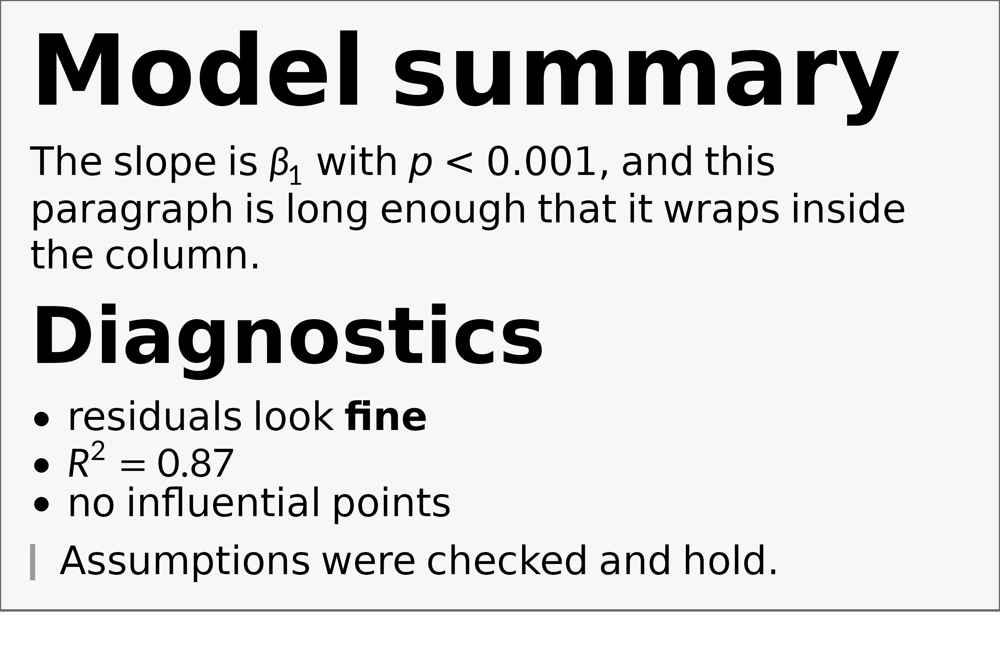
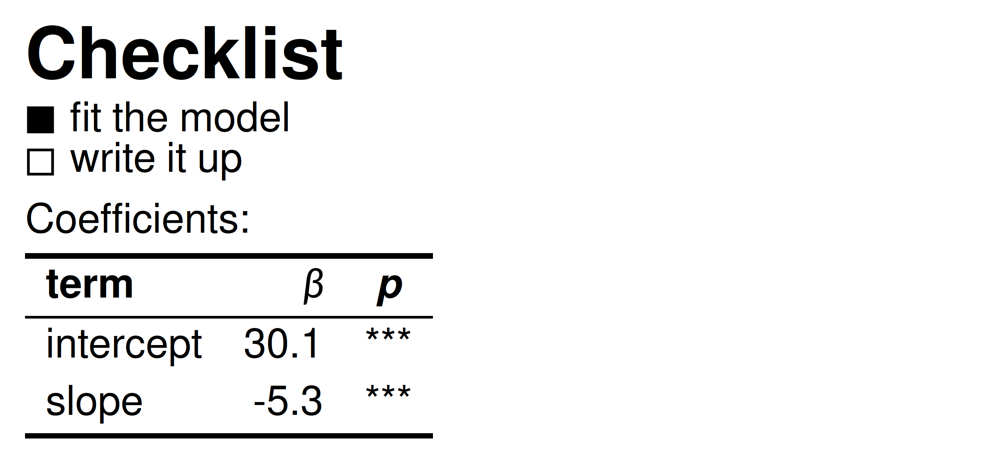
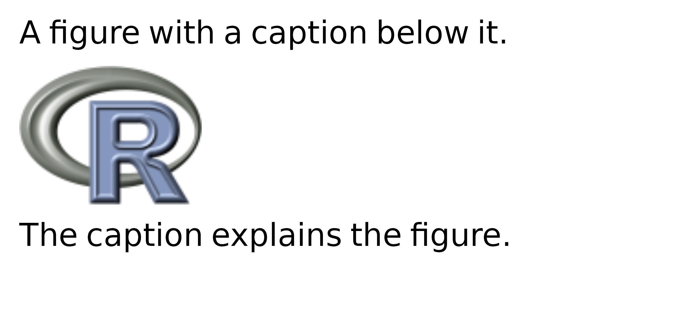
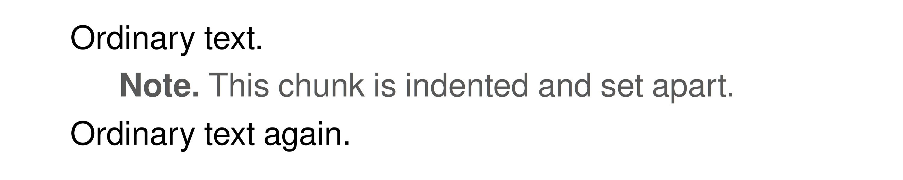
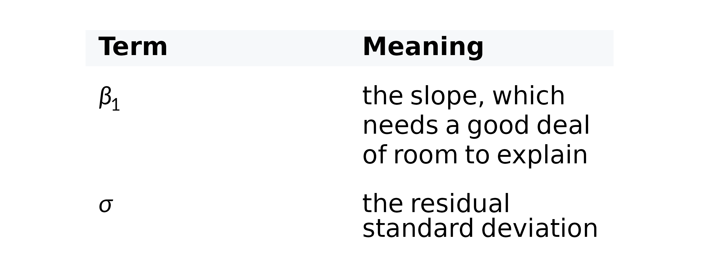
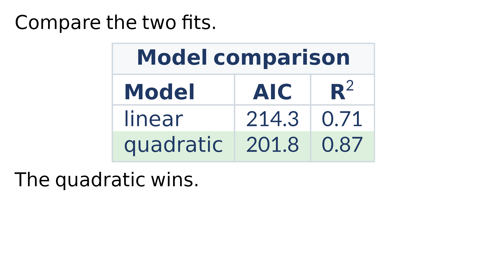

# Rendering Markdown with Math

Plot labels are rarely pure math. A title might be a bold phrase with a
symbol in it; a caption might be a short paragraph that happens to
contain an equation. `gridmicrotex` renders
[CommonMark](https://commonmark.org) markdown *and* LaTeX math together,
in one grob, with no external LaTeX installation.

**These functions are a wrapper around
[`latex_grob()`](https://adayim.github.io/gridmicrotex/reference/latex_grob.md)**
— your markdown is turned into LaTeX and drawn by the same engine. So
everything
[`latex_grob()`](https://adayim.github.io/gridmicrotex/reference/latex_grob.md)
renders works here too, with the same fonts, the same options and the
same limits (see
[`vignette("getting-started")`](https://adayim.github.io/gridmicrotex/articles/getting-started.md)),
and this vignette covers only what markdown adds on top.

There are two entry points:

- **[`markdown_grob()`](https://adayim.github.io/gridmicrotex/reference/markdown_grob.md)**
  (and
  [`grid.markdown()`](https://adayim.github.io/gridmicrotex/reference/markdown_grob.md))
  for a single flowing run of text — the right choice for a title or an
  axis label.
- **[`markdown_box_grob()`](https://adayim.github.io/gridmicrotex/reference/markdown_box_grob.md)**
  for a whole block document — headings, lists, block quotes, code,
  tables — inside an optional padded, filled box.

## Inline markdown

[`markdown_grob()`](https://adayim.github.io/gridmicrotex/reference/markdown_grob.md)
handles the inline part of markdown — `**bold**`, `*italic*`,
`` `code` ``, `~~strikethrough~~` — and any `$math$`.

``` r

grid.newpage()
grid.markdown(
  r"(The **fitted** $\hat{\beta} = (X^\top X)^{-1} X^\top y$ has ~~no~~ `se` = *0.42*.)",
  x = 0.02, hjust = 0, gp = gpar(fontsize = 13)
)
```


### Colour and inline HTML

Markdown has no syntax for colour, underline, super/subscript, highlight
or size. Use inline HTML; each tag does what it does in a browser:

| tag | effect |
|----|----|
| `<b>`, `<strong>` | bold |
| `<i>`, `<em>`, `<cite>`, `<dfn>`, `<var>` | italic |
| `<code>`, `<kbd>`, `<samp>`, `<tt>` | monospace |
| `<u>`, `<ins>` | underline |
| `<s>`, `<del>`, `<strike>` | strikethrough |
| `<sub>`, `<sup>` | sub / superscript |
| `<mark>` | yellow highlight |
| `<small>`, `<big>` | smaller / larger |
| `<q>` | wrapped in quotation marks |
| `<ruby>`, `<rt>` | annotation above the base (furigana) |
| `&nbsp;` | non-breaking space |
| `<br>` | line break |
| `<span style="…">` | any property from [`?md_style`](https://adayim.github.io/gridmicrotex/reference/md_style.md) |

`<ruby>` is worth singling out: `<ruby>漢<rt>かん</rt></ruby>` sets the
annotation above its base with `\overset`, which is how furigana and
bopomofo are typeset. Neither marquee nor gridtext can do this.

In a `style` attribute: `color` takes any R colour name, the nine CSS
names R happens to lack (`crimson`, `teal`, `rebeccapurple` and
friends), `#rgb`, `#rrggbb` or
[`rgb()`](https://rdrr.io/r/grDevices/rgb.html) — but note that `green`,
`gray`, `grey`, `maroon` and `purple` keep their R values rather than
their (darker) CSS ones, so that they mean the same thing here as in
`gpar(col = ...)`; `text-decoration` takes `underline` or
`line-through`; `font-size` takes `pt`, `px`, `in`, `cm`, `mm`, `em`,
`rem`, `%`, `smaller` or `larger`; `font-family` takes the CSS generics
`monospace`, `sans-serif` and `serif`, or any font name, including via a
fallback list like `'Courier New', monospace`. Any other property is
ignored.

One figure with most of the table in it — a sized and coloured span, two
font families, a subscript, an underline, a highlight, and the blank
line that two `<br>` leave behind:

``` r

grid.newpage()
grid.markdown(
  r"(<span style="font-size:22pt;color:#2E5E8E">Model fit</span>,
     <span style="font-family:serif">serif</span> and
     <span style="font-family:monospace">mono</span>.<br><br>
     The <span style="color:#B22222">**residual**</span> for H<sub>0</sub>
     is <u>within</u> <mark>$2\sigma$</mark>.)",
  x = 0.02, y = 0.9, hjust = 0, vjust = 1, gp = gpar(fontsize = 13)
)
```


Tags nest, and markdown and `$math$` keep working inside them, so
`<u>**bold underlined**</u>` and `**<u>the same thing</u>**` render
alike. Any other tag is dropped and its text kept — as a browser does
with `<a>` or a bare `<span>`, which have no rendering of their own.

## Block documents

[`markdown_box_grob()`](https://adayim.github.io/gridmicrotex/reference/markdown_box_grob.md)
lays out a full markdown document. Each block — heading, paragraph,
list, quote, code, table — becomes its own grob, stacked top to bottom.
The `width` you give is the box width; prose wraps to fit it.

``` r

md <- r"(
# Model summary

The slope is $\beta_1$ with *p* < 0.001, and this paragraph is long
enough that it wraps inside the column.

## Diagnostics

- residuals look **fine**
- $R^2 = 0.87$
- no influential points

~~~r
fit <- lm(y ~ x, data = d)  # refit
if (anyNA(d)) {
    stop("missing values")
}
~~~

> Assumptions were checked and hold.
)"

grid.newpage()
grid.draw(markdown_box_grob(
  md,
  width   = unit(4.6, "in"),
  padding = unit(10, "pt"),
  box_gp  = gpar(fill = "grey97", col = "grey40"),
  gp      = gpar(fontsize = 13),
  style = markdown_style(css = "pre { background: #ece2f0 }") # Code background
))
```



A fenced block that names a language is syntax-highlighted, and its
indentation is kept. (The example above fences with `~~~r` rather than
three backticks only because it lives inside an R chunk in this
vignette, where a backtick fence would end the chunk; both spellings are
standard CommonMark.)
[`available_highlighters()`](https://adayim.github.io/gridmicrotex/reference/available_highlighters.md)
lists what is built in — R, Python, SQL, shell, C++, YAML, JSON, Stan,
Julia and LaTeX — and the usual GitHub aliases (`py`, `sh`, `c++`,
`yml`, `jl`, `tex`) work too. A fence naming anything else is set as
plain monospace.

Colours are ordinary CSS, using the same class names knitr writes into
HTML output, so a Pandoc syntax theme can be pasted straight in:

``` r

markdown_style(css = ".co { color: #59636E } .kw { color: #CF222E }")
```

Those are ordinary class selectors, and they are global: seventeen
two-letter names (`co`, `st`, `kw`, `cf`, `dv`, `fl`, `cn`, `fu`, `dt`,
`bu` and friends) carry a default colour. If you use one of them as your
own class in prose — `<div class="dt">` — it picks up the syntax colour,
and a tag rule cannot override it, because a class beats a tag in CSS
just as it does in a browser. Pick another name for your own classes, or
restyle the one you want.

[`register_highlighter()`](https://adayim.github.io/gridmicrotex/reference/register_highlighter.md)
adds a language from a KDE syntax XML file — either one of your own
(copy a bundled grammar from
`system.file("highlight", package = "gridmicrotex")` as a template) or
one downloaded from <https://kate-editor.org/syntax/>, most of which
work as they are.

Set `box_gp = NULL` to draw no box, or give the `r` argument a value
such as `unit(6, "pt")` for rounded corners. `padding` and `margin`
accept a single unit or a length-4 unit giving top, right, bottom, left.

### Lists, tasks, and tables

Ordered and unordered lists, GFM task lists, and tables all render.
Markdown tables become real typeset tables, with column alignment taken
from the `|:---:|` markers — something a text renderer cannot do.

``` r

md <- r"(
### Checklist

- [x] fit the model
- [ ] write it up

Coefficients:

| term | $\beta$  | *p* |
|:-----|------------:|:---:|
| intercept | 30.1 | *** |
| slope | -5.3 | *** |
)"

grid.newpage()
grid.draw(markdown_box_grob(
  md,
  width   = unit(4.4, "in"),
  padding = unit(8, "pt"),
  gp      = gpar(fontsize = 13)
))
```



### Images

An image on its own line is drawn as a raster, scaled to the column
width. `png` and `jpeg` are optional — if neither is installed, or the
file is missing, the image degrades to its alt text.

``` r

# Any .png / .jpeg path works; this one ships with the png package.
img <- system.file("img", "Rlogo.png", package = "png")

md <- sprintf("
A figure with a caption below it.


The caption explains the figure.
", img)

grid.newpage()
grid.draw(markdown_box_grob(
  md, width = unit(4, "in"), padding = unit(8, "pt"),
  gp = gpar(fontsize = 13)
))
```



## Styling

Everything above uses the built-in look. To change it, hand
[`markdown_box_grob()`](https://adayim.github.io/gridmicrotex/reference/markdown_box_grob.md)
a `style`. It is a small CSS cascade over the markdown tags, and it
takes CSS directly — as text, or as the path to a `.css` file:

``` r

doc <- r"(
# Results

The slope is $\beta_1$ with *p* < 0.001.

> Worth a second look.
)"

grid.newpage()
grid.draw(markdown_box_grob(
  doc,
  width = unit(4.5, "in"), padding = unit(10, "pt"),
  style = "
    h1         { color: steelblue; font-size: 1.8rem }
    blockquote { color: grey40; border-left: 3px solid steelblue }
  ",
  gp = gpar(fontsize = 13)
))
```


The same thing written in R, which validates property names and
autocompletes:

``` r

markdown_style(
  h1         = md_style(color = "steelblue", font_size = 1.8),
  blockquote = md_style(color = "grey40",
                        border_left = "3px solid steelblue")
)
```

Lengths take three forms: a bare number is `rem`, a multiple of the body
font size; a string is whatever CSS says (`"1.8rem"`, `"12pt"`,
`"150%"`); and a [`grid::unit()`](https://rdrr.io/r/grid/unit.html) is
absolute.

Tags are named as in HTML — `body`, `p`, `h1`–`h6`, `ul`, `ol`, `li`,
`blockquote`, `pre`, `code`, `strong`, `em`, `a`, `table`, `tr`, `td`,
`th`, `hr`, `img`, `math`, `footnote`, `div`, `span`. The properties are
colour, the font family, size, weight and slant, decorations, line
height, margins, left padding, alignment and the two borders.
[`?md_style`](https://adayim.github.io/gridmicrotex/reference/md_style.md)
has the full table, including which of them work on an inline `<span>`
as well as on a block. Anything outside it parses and is then ignored,
the way a browser ignores what it does not implement — so an existing
stylesheet can be pasted in and the parts that apply still work.

### Starting from a preset

`markdown_style("github")` is a GitHub-like look, shipped as a CSS file
you can read and copy:

``` r

markdown_style("github", h1 = md_style(color = "firebrick"))
file.show(system.file("css", "github.css", package = "gridmicrotex"))
```

Pass an existing style as the first argument to extend it, and use
`latex_options(markdown_style = ...)` to set one for a whole document.

### Styling one chunk

A style set says how *every* heading looks. To style one particular
chunk, wrap it in a `<div>` with a `class` or a `style`. **Leave blank
lines around the tags** — that is what makes CommonMark parse the
markdown between them rather than treating the whole block as raw HTML:

``` r

doc <- '
Ordinary text.

<div class="note">

**Note.** This chunk is indented and set apart.

</div>

Ordinary text again.
'

grid.newpage()
grid.draw(markdown_box_grob(
  doc,
  width = unit(4.5, "in"), padding = unit(10, "pt"),
  style = ".note { color: grey35; padding-left: 1.5rem }",
  gp = gpar(fontsize = 13)
))
```



Inheritable properties — colour and the `font-*` family — fall through
to everything inside the div, exactly as in CSS; margins, padding and
borders do not. `<span class="...">` works the same way for an inline
run.

### Styling tables

Tables take row and cell fills, rule colour and weight, and column
spacing. The tags nest as in HTML: `tr`, `td` and `th` inherit through
`table`.

| CSS                             | effect                         |
|---------------------------------|--------------------------------|
| `table { border-color }`        | colour of every rule           |
| `tr { background }`             | fills a whole row              |
| `td`, `th` `{ background }`     | fills one cell                 |
| `tr { border-bottom }`          | a rule under each row          |
| `td { border-left }`            | vertical rules between columns |
| `td { padding-left }`           | the gap between columns        |
| `table { table-layout: fixed }` | see below                      |

Header cells are **bold** by default, which needs saying because it
could not be done before: `\text{}` resets the font style, so wrapping a
finished table in `\textbf{}` has no effect. The emphasis is applied as
each cell is generated instead.

By default a table sizes to its content, so a wide one overflows the
box. `table-layout: fixed` divides the available width between the
columns and lets the cells wrap:

``` r

tbl <- r"(
| Term | Meaning |
|:-----|:--------|
| $\beta_1$ | the slope, which needs a good deal of room to explain |
| $\sigma$ | the residual standard deviation |
)"

grid.newpage()
grid.draw(markdown_box_grob(
  tbl,
  width = unit(4, "in"), padding = unit(8, "pt"),
  style = "
    table { table-layout: fixed; border-color: #D1D9E0 }
    th    { background: #F6F8FA }
    tr    { border-bottom: 1px solid #D1D9E0 }
  ",
  gp = gpar(fontsize = 13)
))
```



## Dropping down to LaTeX

Anything markdown cannot express, write as LaTeX inside a math span.

The clearest case is a table: markdown tables have no spanning cells and
no per-cell colour, and a LaTeX `array` has both.

``` r

tbl <- r"($$\begin{array}{|l|c|c|}\hline
\rowcolor{#F6F8FA}\multicolumn{3}{|c|}{\textbf{Model comparison}}\\\hline
\textbf{Model}&\textbf{AIC}&\textbf{R}^2\\\hline
\text{linear}&214.3&0.71\\
\cellcolor{#DDF0DD}\text{quadratic}&\cellcolor{#DDF0DD}201.8&\cellcolor{#DDF0DD}0.87\\\hline
\end{array}$$)"

grid.newpage()
grid.draw(markdown_box_grob(
  paste0("Compare the two fits.\n\n", tbl, "\n\nThe quadratic wins."),
  width = unit(4.6, "in"), padding = unit(10, "pt"),
  style = "math { color: #1F3864; font-size: 1.1rem }",
  gp = gpar(fontsize = 13)
))
```



That is one `\multicolumn` spanning header, a `\rowcolor` band and three
`\cellcolor` cells — none of which GFM table syntax can express. The
same route reaches `cases`, `aligned`, `\multirow`, `\newcolumntype` and
everything else in
[`vignette("getting-started")`](https://adayim.github.io/gridmicrotex/articles/getting-started.md).

Note the header cell written `\textbf{R}^2` rather than `\textbf{R^2}`.
Inside `$$…$$` you are already in math mode, so `^` superscripts — but
`\textbf{}` switches to *text* mode, where `^` is an accent rather than
a superscript operator and `R^2` comes out flat. Put the superscript
outside the text command. There is no need to open `$…$` again either:
delimiters do not nest, and an escaped `\$` would simply typeset a
dollar sign.

**Styling reaches the block, not inside it**, and that figure shows both
halves at once. The `math` rule sets the colour and size of the table’s
text but leaves the prose either side black, because those properties
travel on the block’s `gp`. The cell fills ignore it completely.

So the cascade cannot see *through* a math span. That `array` is math,
not a markdown table, and `table`, `tr` and `td` rules leave it
untouched — which is why its colours had to be written in LaTeX rather
than CSS. That is the trade: a GFM table is styled by the cascade but
cannot span cells; a LaTeX `array` spans anything but is styled in
LaTeX.

## What is and isn’t supported

Full CommonMark plus the GitHub extensions — tables, strikethrough,
autolinks and task lists — is parsed, so parsing is never the
limitation.

Nothing errors: anything that cannot be drawn degrades to its text. This
document contains every degradation at once, which is easier to look at
than to read about:

``` r

doc <- r"(A [link](https://example.org) keeps its text, an
 becomes its alt text, and an
<unknown>unknown tag</unknown> keeps its content.

Footnotes[^1] land at the foot.

<table><tr><td>an HTML table is dropped</td></tr></table>

[^1]: Like this one.)"

grid.newpage()
grid.draw(markdown_box_grob(
  doc,
  width = unit(4.4, "in"), padding = unit(8, "pt"),
  gp = gpar(fontsize = 13)
))
```


The link is styled but inert, the missing image shows its alt text, the
unknown tag is stripped and its words kept, the footnote is numbered and
moved to the foot, and the HTML table is gone entirely — no error, no
placeholder. In detail:

- **Inline images** keep their alt text only. A block-level image, alone
  on its line, is drawn.
- **Links** keep their text; the destination is dropped. They are styled
  blue and underlined through the `a` tag, which a stylesheet can
  change.
- **Footnotes** (`[^1]` with a `[^1]:` definition) put a superscript
  marker in place and the note at the foot, after a rule. Only in
  [`markdown_box_grob()`](https://adayim.github.io/gridmicrotex/reference/markdown_box_grob.md);
  [`markdown_grob()`](https://adayim.github.io/gridmicrotex/reference/markdown_grob.md)
  shows the marker and drops the note.
- **Display math** — a paragraph that is nothing but `$$…$$` — gets its
  own centred line, styleable as the `math` tag. Inline `$…$` is
  unaffected.
- **Small caps** and `font-variant-numeric` are not rendered.
- **Block-level HTML** other than `<div>` is dropped, `<table>` included
  — use GFM’s table syntax.
- **Spanning cells** are not reachable from markdown table syntax. Write
  the table as LaTeX instead; see *Dropping down to LaTeX*.
- **Syntax highlighting** refuses a downloaded grammar that uses KDE’s
  *dynamic* rules rather than colouring it approximately; thirteen of
  twenty sampled definitions loaded.
- **Code comes out slightly tight** on `png(type = "cairo")` and
  `svglite`, which report sans widths for the `"mono"` family. Use
  [`ragg::agg_png()`](https://ragg.r-lib.org/reference/agg_png.html) if
  that matters.

Everything else — emphasis, headings, lists, quotes, tables, rules,
block images, footnotes, ruby annotation, and of course `$math$` —
renders.
